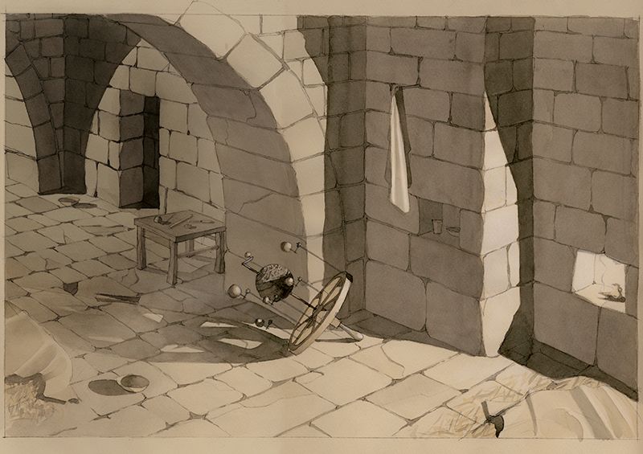
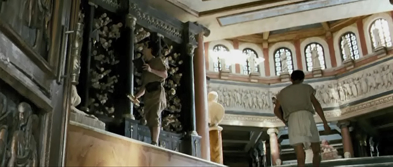

Diseño de Atrezzo

- **Director**: Alejandro Amenabar
- **Producción**: Telecinco Cinema y Mod Producciones

La película ha ganado, entre otros, el Goya a mejor dirección artística (director artístico Guy Hendrix Dyas)

Estudios previos para el decorado de la biblioteca de Alejandría

Dibujo para el decorado de la biblioteca de Alejandría

Dibujo para el decorado de la biblioteca de Alejandría

Dibujos para el decorado de la biblioteca de Alejandría

Estudios previos para el decorado del cuartel general del prefecto

Dibujo para el decorado del cuartel general del prefecto

Dibujo para el trono del prefecto

Dibujo para el trono del prefecto

Dibujo para el trono del prefecto

Dibujo para el trono del prefecto

Dibujo para el trono del prefecto

Dibujo para el trono del prefecto

Dibujo para el decorado del cuartel general del prefecto

Estudios previos para la maqueta de Davus

Dibujo para el decorado de la casa de Davus

Dibujo para la maqueta de Davus

Fotogramas de la película
