Coordinación de construcción

- **Director**: Fernando Trueba
- **Producción**: Andrés Vicente Gomez-Lola Films

- [El embrujo de Shanghai en Youtube](https://www.youtube.com/watch?v=HBNH5_hRQQY)
- [El embrujo de Shanghai en IMDB](http://www.imdb.com/title/tt0264571/fullcredits?ref_=tt_ov_st_sm)

La película ha ganado, entre otros, el Goya a mejor dirección artística (dirección artística Salvador Parra)

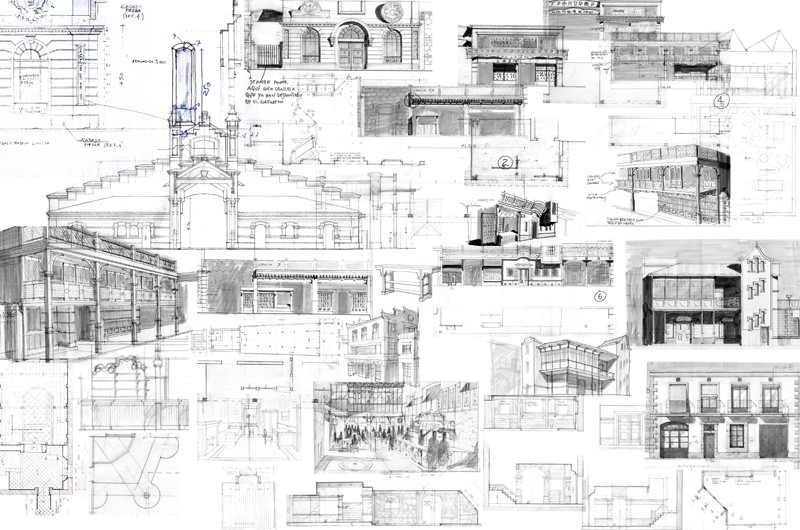
Planos para la construcción

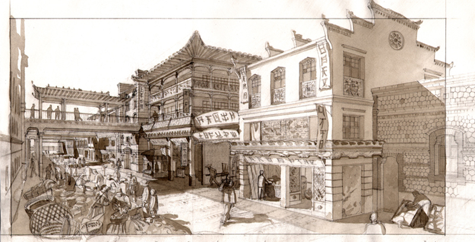
Dibujo para el decorado de la calle de Shanghai

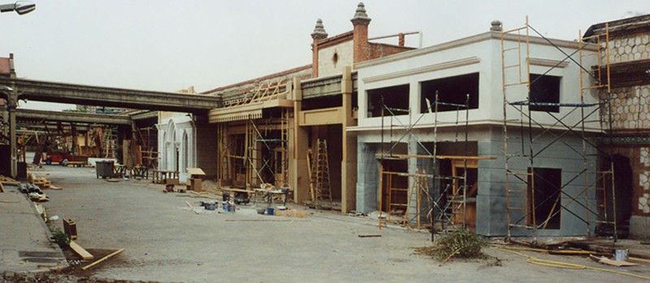
Foto del decorado de la calle de Shanghai durante la construcción

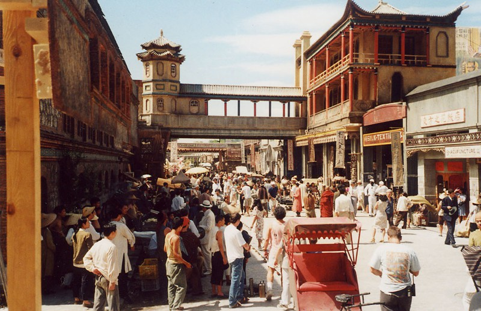
Foto del decorado de la calle de Shanghai durante el rodaje

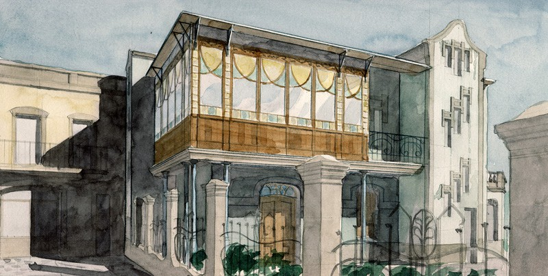
Dibujo para el decorado de la casa de Susana

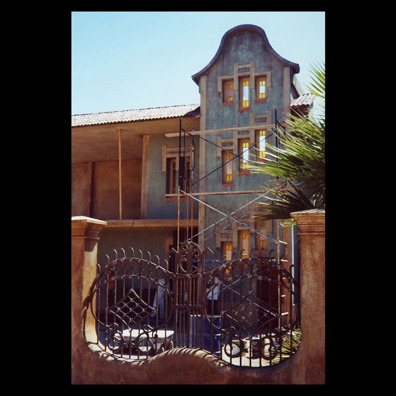
Foto del decorado de la casa de Susana durante la construcción

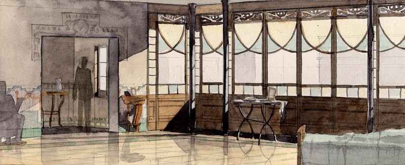
Dibujo para el decorado interior de la casa de Susana

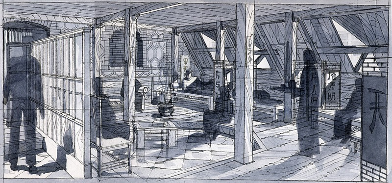
Dibujo para el decorado del fumadero de opio

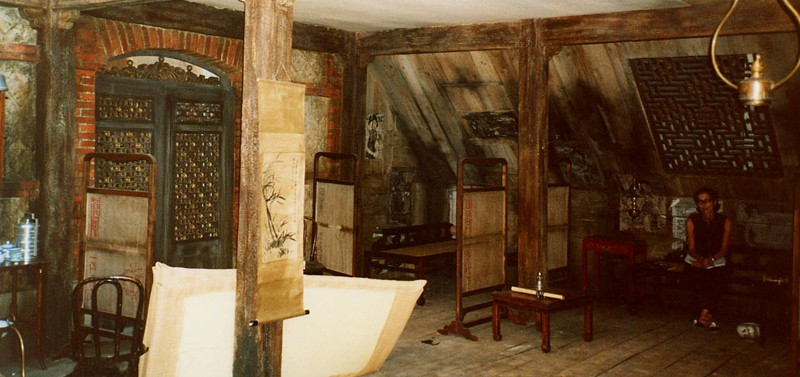
Foto del decorado del fumadero de opio durante la construcción

Dibujo para la entrada del decorado del fumadero de opio

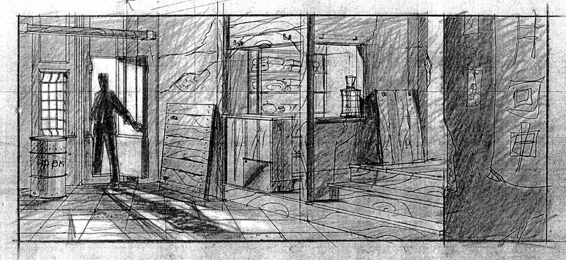
Dibujo para la entrada del decorado del fumadero de opio

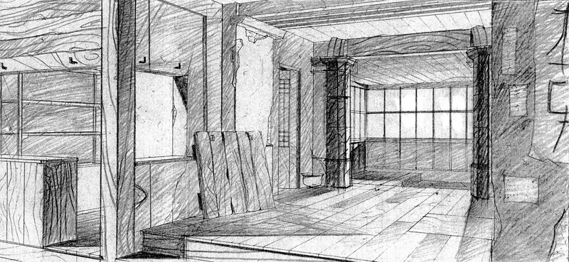
Dibujo para la entrada del decorado del fumadero de opio

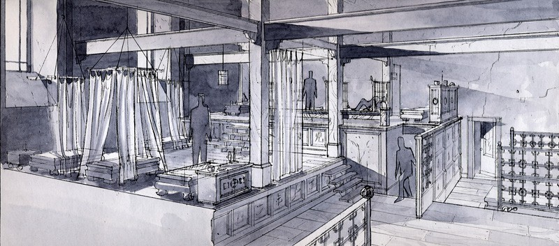
Dibujo para una versión anterior del decorado del fumadero de opio

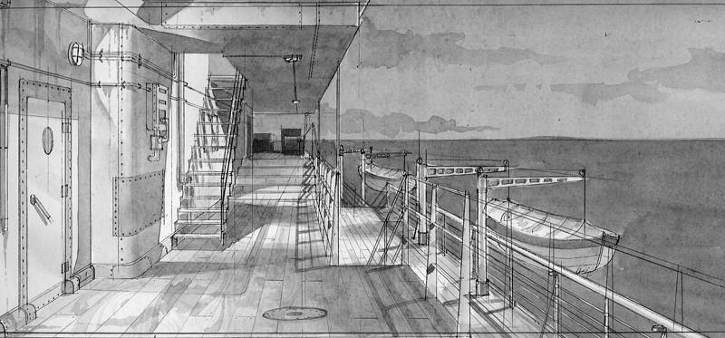
Dibujo para el decorado del barco

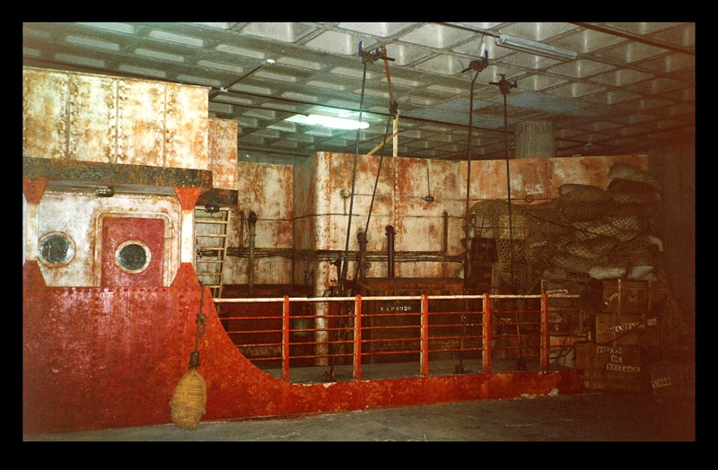
Foto del decorado del barco durante la construcción

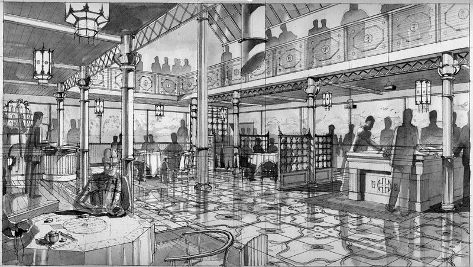
Dibujo para el decorado del local *Yellow Sky*

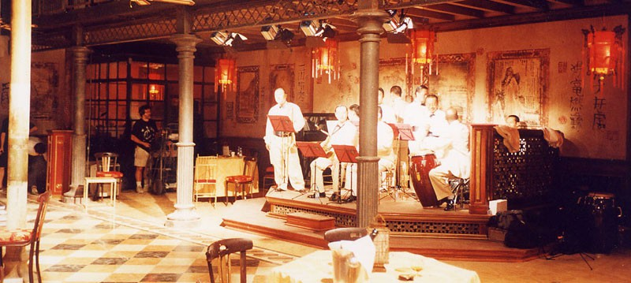
Foto del decorado del *Yellow Sky* durante el rodaje

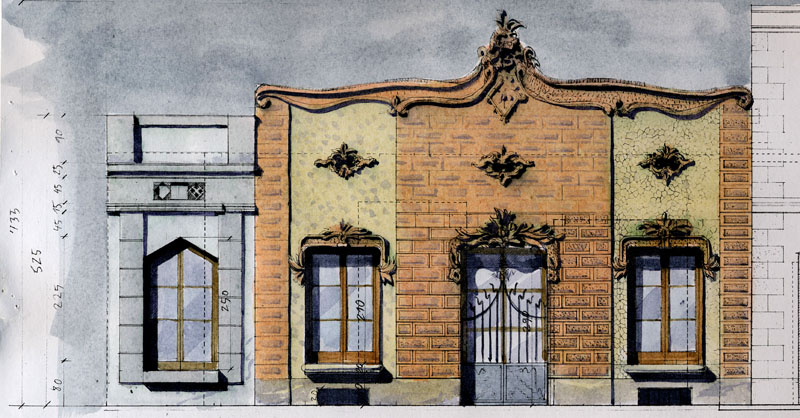
Dibujo para una casa de Barcelona

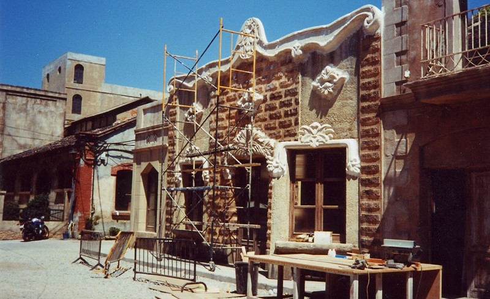
Foto de una casa de Barcelona durante la construcción

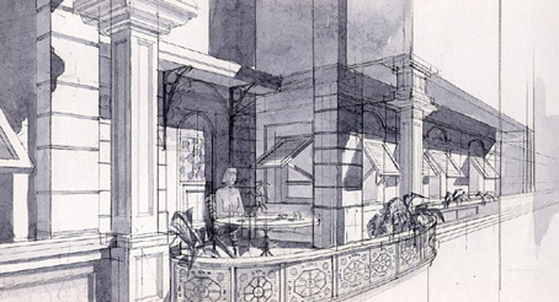
Dibujo para la terraza de Chen

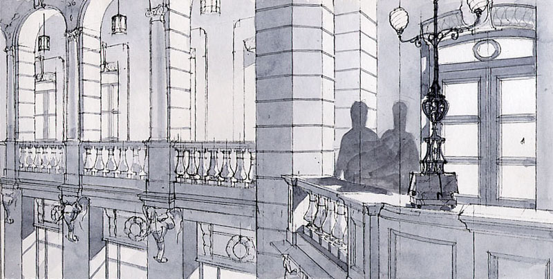
Dibujo para la terraza del *Cathay*
