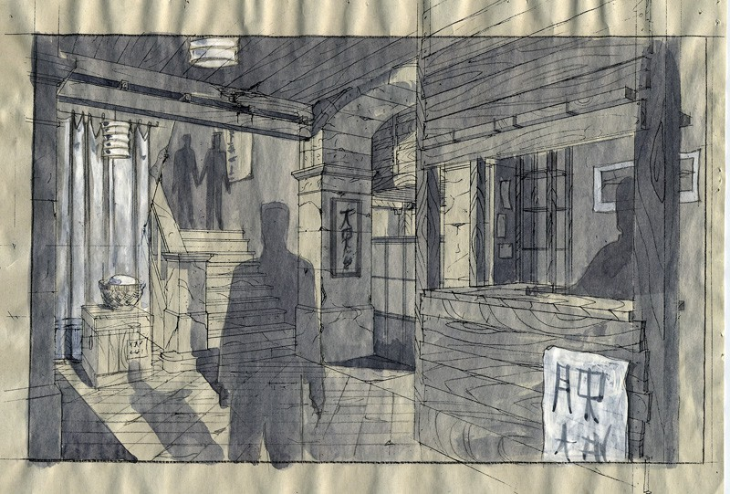

Coordinación de construcción

- **Director**: Fernando Trueba
- **Producción**: Andrés Vicente Gomez-Lola Films

- [El embrujo de Shanghai en Youtube](https://www.youtube.com/watch?v=HBNH5_hRQQY)
- [El embrujo de Shanghai en IMDB](http://www.imdb.com/title/tt0264571/fullcredits?ref_=tt_ov_st_sm)

La película ha ganado, entre otros, el Goya a mejor dirección artística (dirección artística Salvador Parra)

Planos para la construcción

Dibujo para el decorado de la calle de Shanghai

Foto del decorado de la calle de Shanghai durante la construcción

Foto del decorado de la calle de Shanghai durante el rodaje

Dibujo para el decorado de la casa de Susana

Foto del decorado de la casa de Susana durante la construcción

Dibujo para el decorado interior de la casa de Susana

Dibujo para el decorado del fumadero de opio

Foto del decorado del fumadero de opio durante la construcción

Dibujo para la entrada del decorado del fumadero de opio

Dibujo para la entrada del decorado del fumadero de opio

Dibujo para la entrada del decorado del fumadero de opio

Dibujo para una versión anterior del decorado del fumadero de opio

Dibujo para el decorado del barco

Foto del decorado del barco durante la construcción

Dibujo para el decorado del local *Yellow Sky*

Foto del decorado del *Yellow Sky* durante el rodaje

Dibujo para una casa de Barcelona

Foto de una casa de Barcelona durante la construcción

Dibujo para la terraza de Chen

Dibujo para la terraza del *Cathay*
