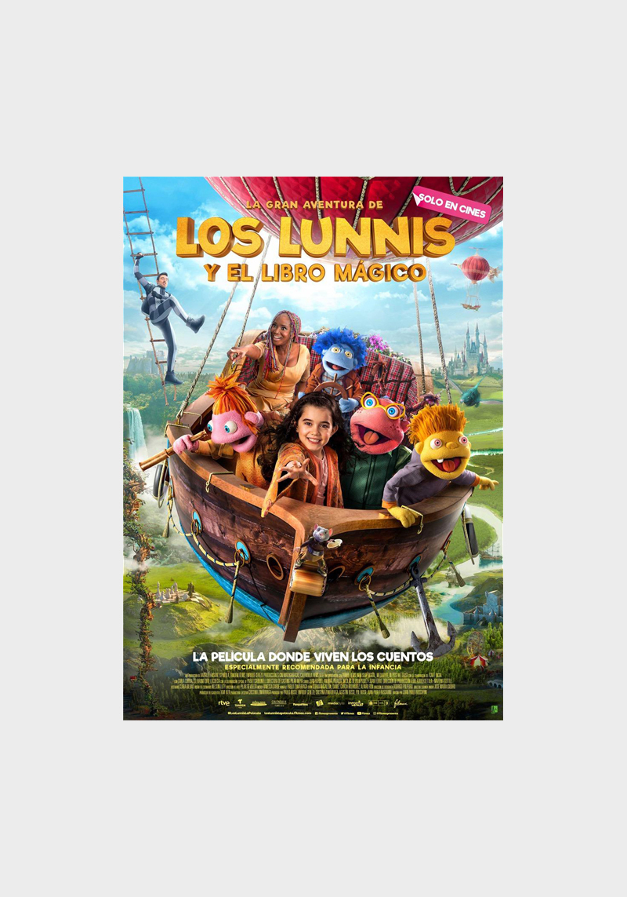
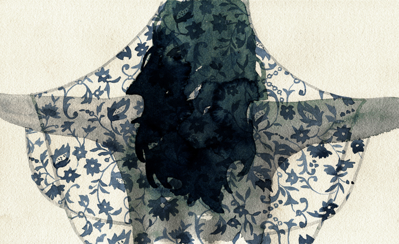
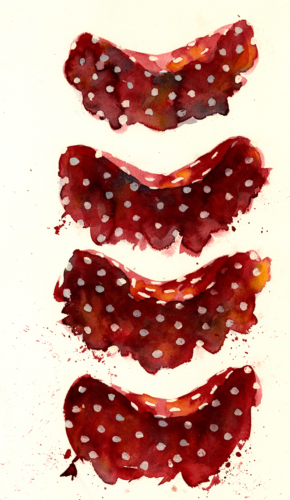

*La gran aventura de los Lunnis y el libro magico* (2018), largometraje. Diseño del barco.

*La gran aventura de los Lunnis y el libro magico* (2018), largometraje. Diseño del barco.

*La gran aventura de los Lunnis y el libro magico* (2018), largometraje. Diseño del barco.

*La gran aventura de los Lunnis y el libro magico* (2018), largometraje. Diseño del barco.

*La gran aventura de los Lunnis y el libro magico* (2018), largometraje. Diseño del barco.

*Spot TWYP ME MONEY* (2018), Prod. Garage Films. Dirección de Arte.

VII Informe sobre exclusión y desarrollo social en España, Caritas y Funda
Foessa (2016), seis spots. Prod. Cipó Company. Dirección artística y realización de los fondos pintados.
[Videos](https://www.youtube.com/channel/UCZ7PynCkyqbWPFZrMquXTxA)

VII Informe sobre exclusión y desarrollo social en España, Caritas y Funda
Foessa (2016), seis spots. Prod. Cipó Company. Dirección artística y realización de los fondos pintados.
[Video](https://www.youtube.com/watch?v=EDvGWKzlWoI)

VII Informe sobre exclusión y desarrollo social en España, Caritas y Funda
Foessa (2016), seis spots. Prod. Cipó Company. Dirección artística y realización de los fondos pintados.
[Video](https://www.youtube.com/watch?v=K_S6vgT4kiQ)

VII Informe sobre exclusión y desarrollo social en España, Caritas y Funda
Foessa (2016), seis spots. Prod. Cipó Company. Dirección artística y realización de los fondos pintados.
[Video](https://www.youtube.com/watch?v=W1CtJVmo1dQ)

Confederación SALUD MENTAL ESPAÑA (2015), vídeo campaña. Prod. Cipó Comp Dirección artística y ejecución gráfica.
[Video](https://www.youtube.com/watch?v=WlClkgB8Xmg)

*Veneno* (2008), 4 spots para la Junta de Andalucía. Prod. Avatar. Dirección artistica e ilustraciones.

*Veneno* (2008), 4 spots para la Junta de Andalucía. Prod. Avatar. Dirección artistica e ilustraciones.

*Crimen ferpecto* (2003), largometraje de Alex de la Iglesia. Ayudante de decoración.

*La Culpa* (2005), largometraje di Chicho Ibáñez Serrador. Dibujos.

*La Culpa* (2005), largometraje di Chicho Ibáñez Serrador. Dibujos.

*Spot Bancaja* (2009), Prod. Got Film. Coordinación de construcción.

*Spot Toyota* (2006), Prod. Got Film. Dibujos.

*Spot Renault Laguna* (2006), Prod. Got Film. Dibujos.

*El secreto del Puente Viejo* (serie tv), Prod. Ida y vuelya. Dibujos.

*El secreto del Puente Viejo* (serie tv), Prod. Ida y vuelya. Dibujos.

*Spot Imagenio* (2005), Prod. Got Film. Dibujos.

*Spot Imagenio* (2005), Prod. Got Film. Dibujos.

*Spot Imagenio* (2005), Prod. Got Film. Dibujos.

*Spot Imagenio* (2009), Prod. Got Film. Dibujos.

*Spot Imagenio* (2005), Prod. Got Film. Dibujos.

*Spot Imagenio* (2005), Prod. Got Film. Dibujos.

*Spot Endesa* (2010), Prod. Euro Rscg. Dibujos.

*Spot Endesa* (2010), Prod. Euro Rscg. Dibujos.

*Spot Ikea* (2007), Prod. Got Film. Dibujos.

*Spot Axe* (2008), Prod. Garlic Film. Dibujos.

*Spot Axe* (2008), Prod. Garlic Film. Dibujos.

*Spot 11888* (2007), Prod. Ovideopub. Dibujos.

*Spot Movistar* (2006), Prod. Tesauro. Dibujos.

*Spot Renault Clio* (2006), Prod. Got Film. Dibujos.

*Spot Renault Clio* (2006), Prod. Got Film. Dibujos.

*Spot Pepsi Cola* (2004), Prod. Wide Scoop. Planos de construcción.

Fotogramas
