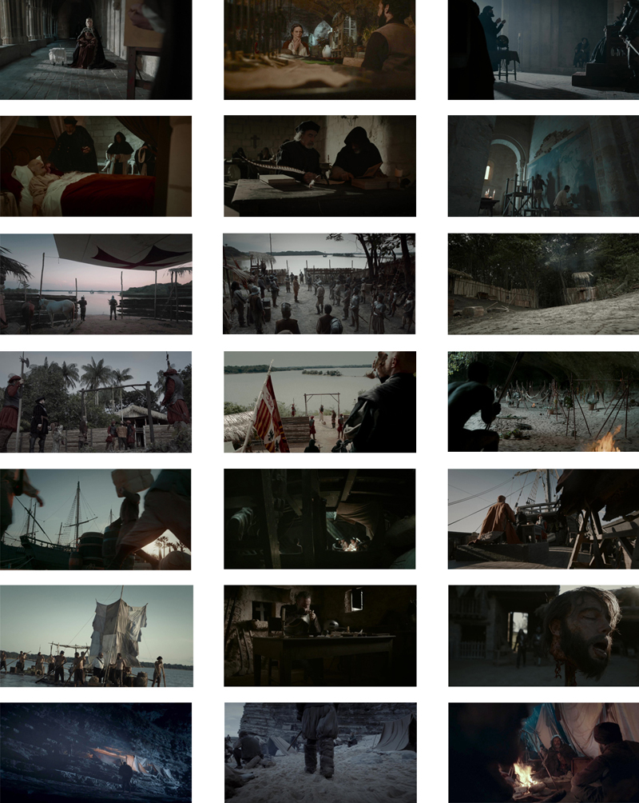
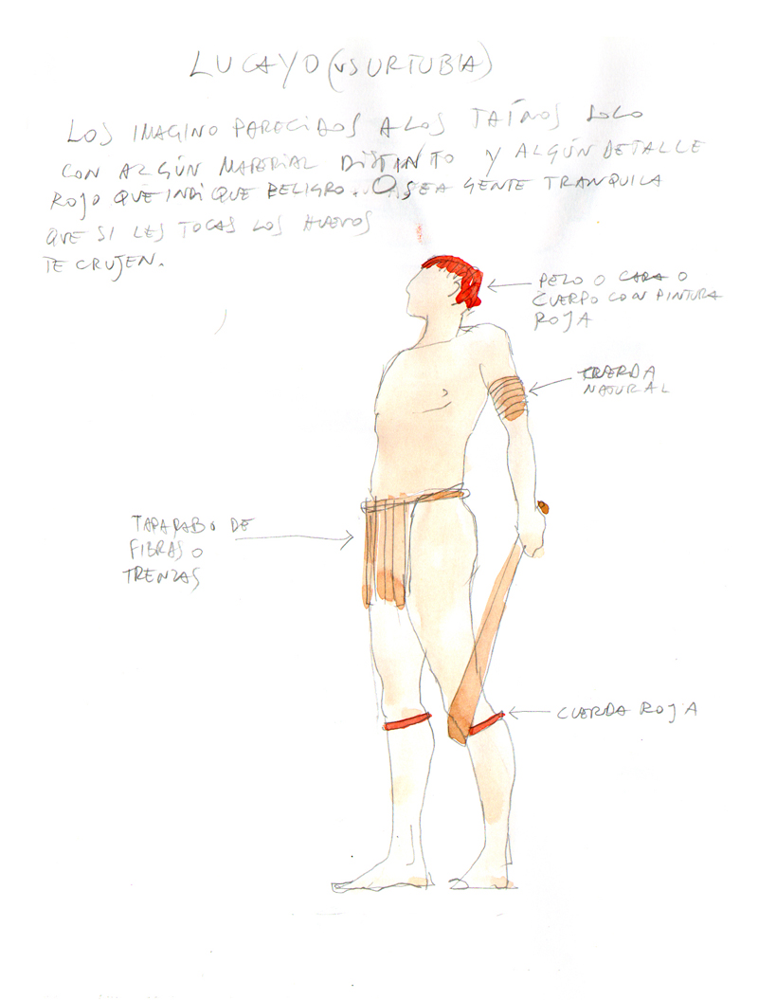

Dirección de Arte

- **Director**: Israel del Santo
- **Producción**: Movistar y Global Set Shooting

### Enlaces relacionados

- [Conquistadores: *Adventum* en Movistar Plus](http://www.movistarplus.es/cero/conquistadores)
- [Conquistadores: *Adventum* en Youtube](https://www.youtube.com/watch?v=zSEd7WsOuv4&list=PLSXGfg6XHVB56cPpVK0lH_frj28tGJKl6)
- [Conquistadores: *Adventum* en IMDB](http://www.imdb.com/title/tt7555582/)

Estudio para Isabel II con el pintor y Fonseca

Estudio para la habitación del Papa

Estudio para la habitación del Papa

Estudio para el salón de la reina

Estudio para la plaza de la decapitación de Nuñez de Balboa

Estudio para un muelle

Estudio para el barco del marchante arabe

Estudio para la bodega de los esclavos de Colón

Estudio para la bodega de Elcano

Estudio para las balsas de Panfilo de Narváez

Estudio para la exposición de Fray Bartolomé de las Casas

Estudio para la exposición de Nebrija

Estudio para el almacén de Colón

Estudio para la habitación de Isabel II

Estudio para el despacho del capitán portugues

Estudio para el despacho de Pedrarias

Estudio para el estudio de los monjes

Estudio para el salón del rey Fernando

Estudio para la recepción del rey de Portugal

Estudio para la perrera

Estudio para la cueva de los indios Kuna

Estudio para el fuerte Natividad

Estudio para la puerta del fuerte Natividad

Estudio para el patibulo de de Bernardino de Talavera

Estudio para el patibulo de Anacaona

Estudio para el campamiento de Magallanes en Mactán

Estudio para el campamento de Magallanes en Patagonia

Estudio para el campamento de Magallanes en Patagonia

Estudio para el campamento de Magallanes en Patagonia

Estudio para el campamento de Magallanes en Patagonia

Fotogramas de la serie

###Estudios para la caracterización de las tribus

Estudio para indio Lucayo

Estudio para indios Lucayos

Estudio para indios

Estudio para indios

Estudio para indios

Estudio para indio

Estudio para mascara de indios canibales

Estudio para indios canibales

Estudio para indios canibales

Estudio para indios Tainos

Estudio para indios

Estudio para indios

Estudio para indigenas filipinos

Estudio para indigenas filipinos

Estudio para guerreros filipinos

Estudio para indigenas filipinos

Estudio para indigenas filipinos

Estudio para el esclavo Enrique

Fotogramas de la serie
