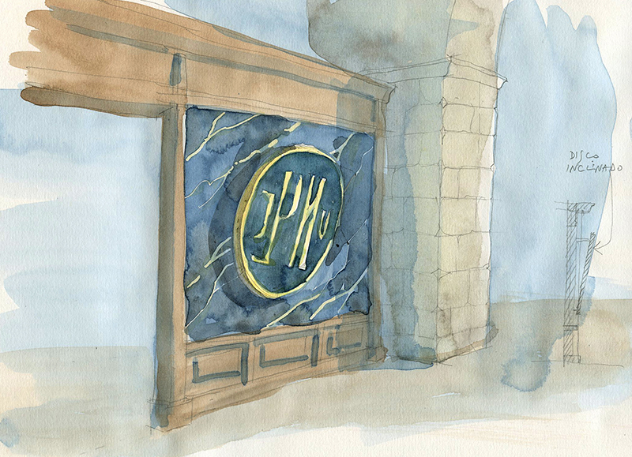
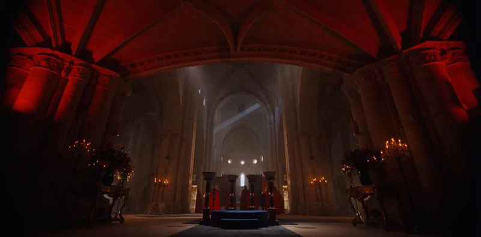
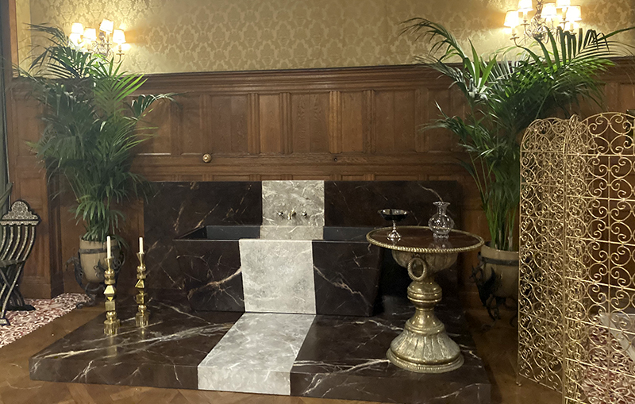
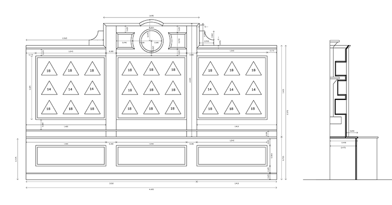

Set Decoration Art Director

Decoradora: Pilar Revuelta

- **Creación**: Marguerite MacIntyre, Julie Plec
- **Producción**: Universal Pictures Television, Calle Cruzada

Dibujos

Croquis para el diván del feeding room (diseño con P. Revuelta y C. Méndez)

Diseño del diván del feeding room (diseño con P. Revuelta y C. Méndez)

Diseño del diván del feeding room (diseño con P. Revuelta y C. Méndez)

El diván del feeding room (diseño con P. Revuelta y C. Méndez)

Feeding room

Diseño de la mesa de Victor

Diseño de la mesa de Victor

Construcción de la mesa de Victor

La mesa de Victor

La mesa de Victor

Dibujo para el Night Club

Diseño de la barra del Night Club

Croquis para los muebles del Night Club

Realización del mural del Night Club

Realización del mural del Night Club

El Night Club

Croquis para los tronos

Diseño de los tronos

Diseño de los tronos

Construcción del trono de la reina

Los tronos

Dibujo de la barra en el salón de la villa

Diseño de la barra

Detalles de la barra

Construcción de la barra

La barra en el salón de la villa

Croquis del presbiterio de la iglesia

Diseño de la balaustrada de la iglesia

Construcción de la balaustrada

La balaustrada de la iglesia

Dibujo para la decoración de la pared de fondo de la iglesia

Dibujo para la decoración de la pared de fondo de la iglesia

Decoración de la pared de fondo de la Iglesia

Decoración de la pared de fondo de la Iglesia

Croquis para el tribunal

Diseño del reclinatorio del tribunal

El reclinatorio del tribunal

El tribunal

Diseño del retablo

Diseño del retablo

Bocetos para las pinturas del retablo

El retablo (pintado por Cesar Pérez)

Dibujo para el museo

El museo

Dibujo para la cerimonia de Lissa en Royal Council Chamber

Royal Council Chamber

Dibujo para la suite de Sonia

Diseño de la bañera de la suite de Sonia

La bañera de la suite de Sonia

Dibujo para la suite de la reina

Dibujo para la suite de la reina

La suite de la reina

Croquis de la calle la noche del ataque

Croquis de la calle la noche del ataque

Croquis de la calle la noche del ataque

Croquis de la calle la noche del ataque

Croquis de la calle la noche del ataque

La calle la noche del ataque

La calle la noche del ataque

La calle la noche del ataque

Croquis para la decoración del alojamiento de los Dhampir

Diseño del muro del honor

Diseño del muro del honor

El muro del honor

Dibujo para la decoración de la piscina

La decoración de la piscina

Dibujo para un escaparate

Dibujo para un escaparate

Forrado de elementos para un escaparate

Forrado de elementos para un escaparate

Escaparate en Lisboa

Escaparate en Lisboa

Dibujo para la trastienda de la tienda de drogas; diseño del mostrador y de las jardineras

La trastienda de la tienda de drogas

La trastienda de la tienda de drogas

Diseño de un mueble para cocktail party

Mueble para cocktail party

Diseño para un mueble en la tienda de mascaras

Mueble en la tienda de mascaras
