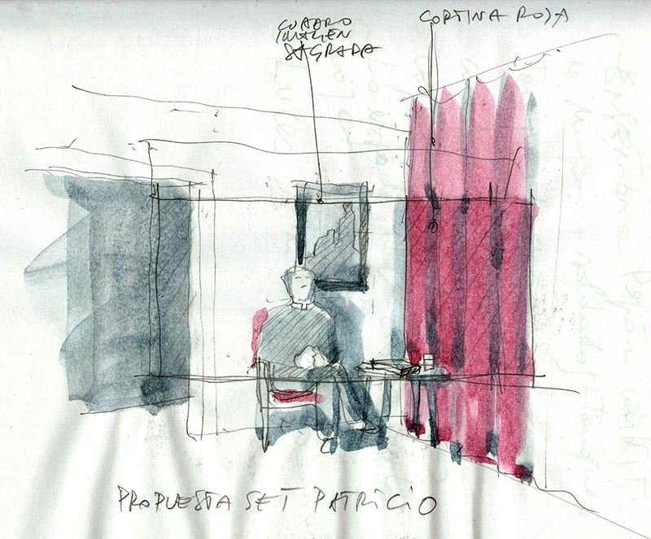

Dirección de Arte

- **Dirección**: Pepón Montero
- **Guion**: Juan Maidagán y Pepón Montero

- **Producción**: Buendía Estudios y Movistar+

Dibujos

Salón de Berta y Ramón

Croquis para el salón de la boda

Croquis para el backstage de la boda

La boda

Salón de la cuñada

Habitación de la cuñada

La cocina de la cuñada

Croquis para el trastero del vecino

El trastero del vecino

Boceto para la mancha en la terraza de la madre

La mancha en la terraza de la madre

Los mantecados (diseño gráfico de Natalia de la Torre)

La casa de Pilar

La casa de la tía de Pilar

Boceto para la casa del artista

Detalle de la casa del artista

Detalle de la casa del artista

Croquis para la entrevista al artista

Set para la entrevista al artista

Croquis para la entrevista a Patricio
