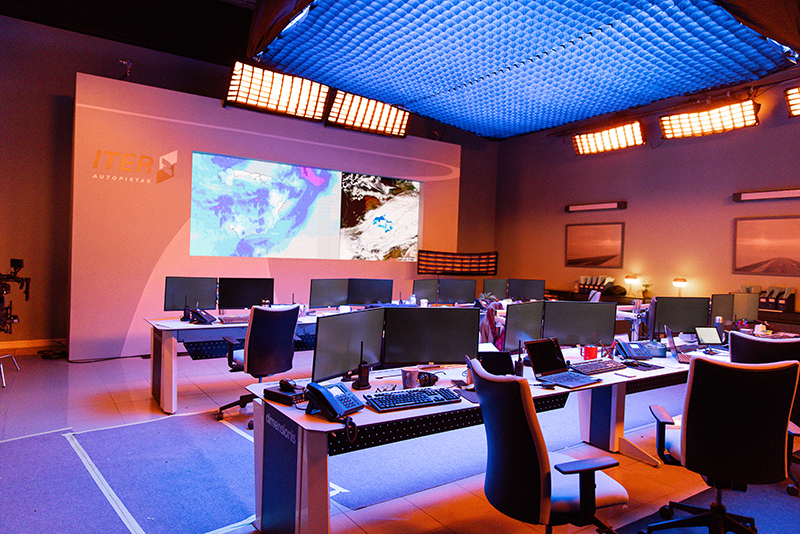

Dirección de construcción

- **Direccción de Arte**: Pilar Revuelta
- **Director**: Daniel Calparsoro
- **Producción**:  Atresmedia Cine, La Terraza Films, Atlantia Media Producciones, Ikiru Films.

Dibujos

Croquis para la carretera

Foto de escena de la carretera. Fotografía de Jimena García

Foto de escena de la carretera. Fotografía de Jimena García

Dibujo para la cámara acorazada

Foto de escena de la cámara acorazada durante la construcción. Fotografía de Jimena García

Foto de escena de la cámara acorazada. Fotografía de Jimena García

Dibujo para la iglesia

Croquis para un hipotesis previo de la cámara acorazada

Croquis para el Centro de Control de Carreteras

Croquis para el Centro de Control de Carreteras

Diseño de los apliques del Centro de Control

Foto de escena del Centro de Control de Carreteras. Fotografía de Jimena García

Foto de la tienda de telefonía intervenida
