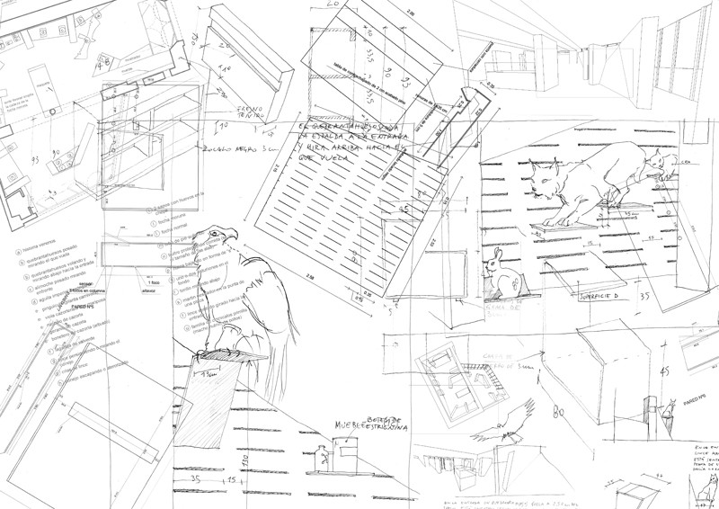
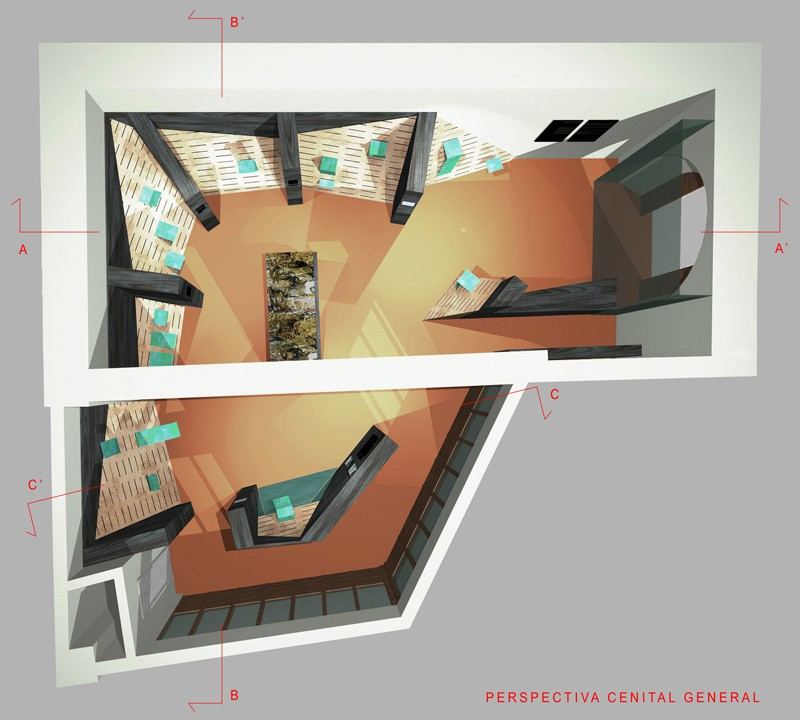
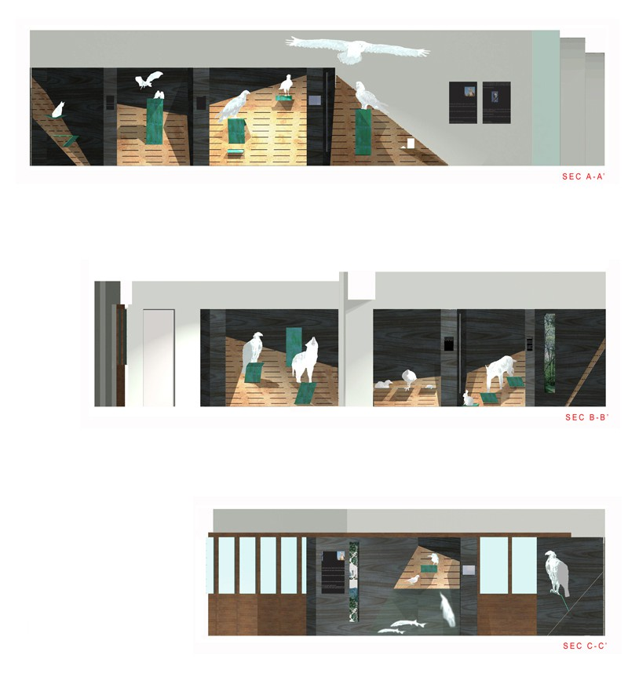
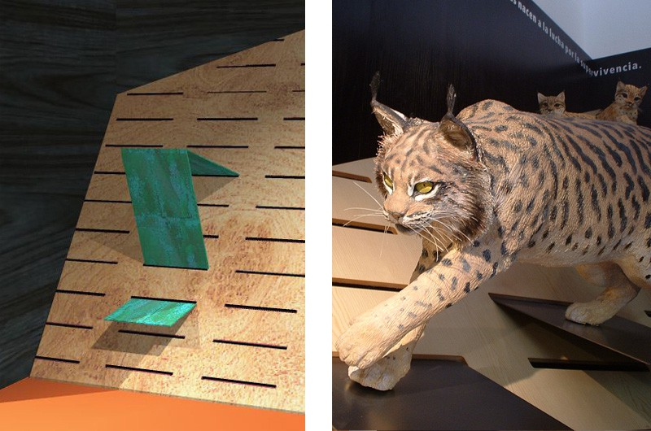
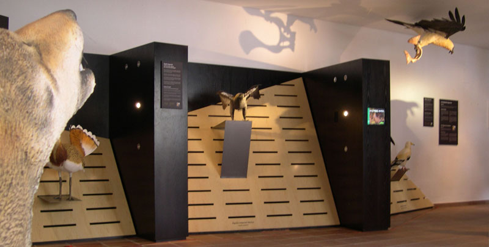
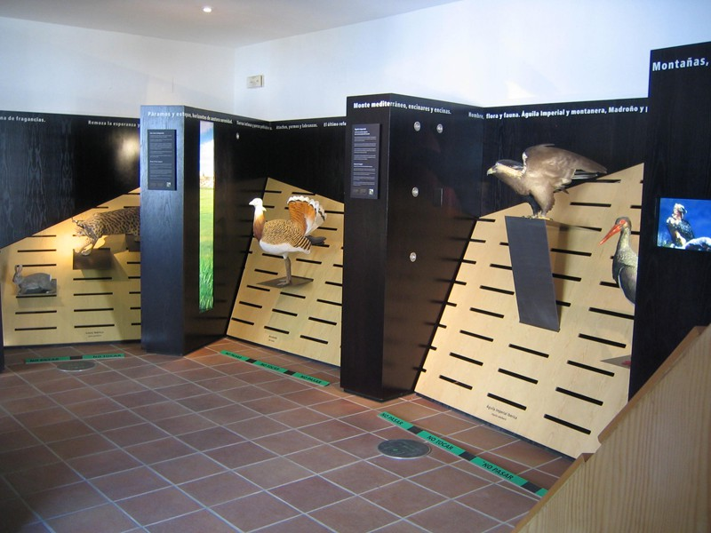
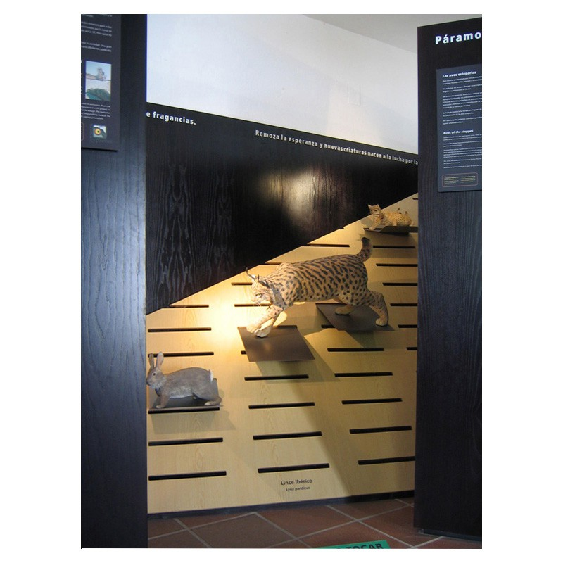
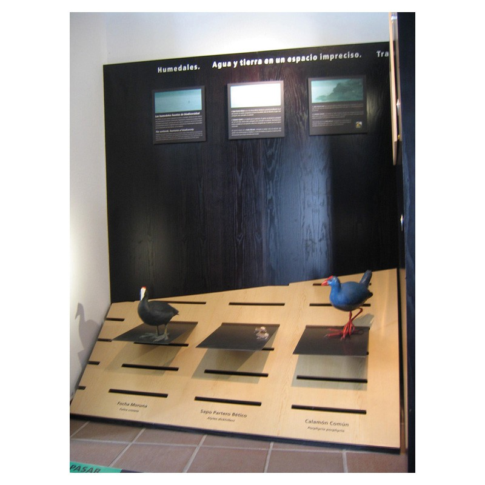
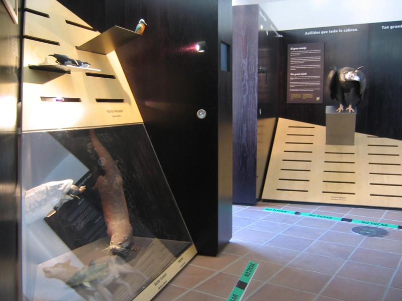
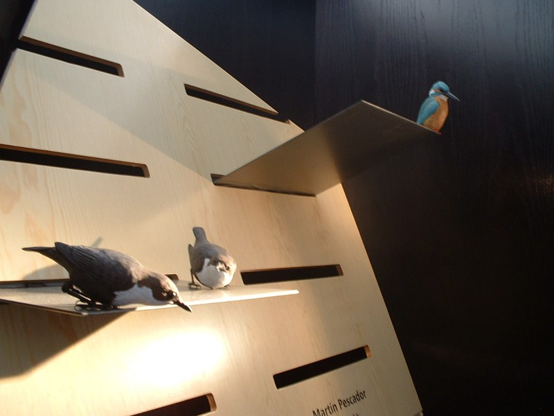

Diseño y dirección artística

Con Cipó Company

Diseño grafico Natalia De la Torre

- **Promotor**: Fundación Gypaetus
- **Lugar**: Fundación Gypaetus, Cazorla (Jaén)

### Enlaces relacionados

- [El centro en la web de Cipó](http://cipocompany.com/portfolios/centro-de-especies-amenazadas-del-parque-natural-de-cazorla/)
- [Video en *Todo Turismo*](http://www.youtube.com/watch?v=HNBqAM6_pkI)

Dibujos

Plano general

Secciones

Dibujo de los soportes y replicas de linces

Vista de las instalaciones

Vista de las instalaciones

Vista de las instalaciones

Vista de las instalaciones

Vista de las instalaciones

Detalle

Entrada del Centro
