Diseño, dirección artística y coordinación de los montajes

Con Cipó Company

Diseño gráfico de Natalia De la Torre

- **Promotor**: Plataforma 2015
- **Lugares**: Palacio de Cibeles de Madrid, Museo de la Evolución Humana de Burgos, Casa das Artes de Vigo, Museo de la Merced en Ciudad Real, Sala San Marcos en Toledo, Museo de Jaén, Centro de Exposiciones de Benalmadena (Malaga), Sala del Ayuntamiento de Rivas Vaciamadrid, Sala Caja Sur de Cordoba, recinto ferial La Hipica de Cuenca, Torre Caja Guadalajara; centros culturales Buro Vallejo de Alcorcón (Madrid), Can Massallera en Sant Boi (Barcelona), CCM San Prudencio de Talavera de la Reina, Obra Social de Caja Castilla La Mancha en Albacete

### Enlaces relacionados

- [Reportaje RTVE](http://www.youtube.com/watch?v=QR98F_-2M3Y)
- [Reportaje RTVE Galicia](http://www.youtube.com/watch?v=JzLXxRpxEjU)
- [Reportaje LA CERCA TV](http://www.youtube.com/watch?v=ZAmGgQoVeHo)
- [Reportaje TELEMADRID](http://www.youtube.com/watch?v=CLNLLw6hqGc&feature=fvst)
- [La exposición en la web de CIPÓ](http://cipocompany.com/portfolios/puertas/)
- [Videos presentes en la exposición](http://www.dailymotion.com/playlist/x1euz2_exea_videos-de-la-exposicion-puertas/1#video=xet8ue)

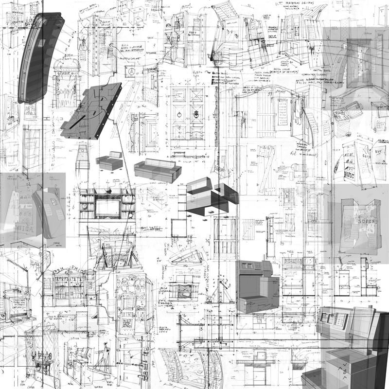
Dibujos

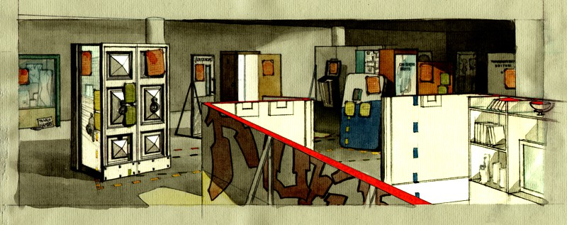
Dibujo para el montaje en la sala del Ayuntamiento de Rivas Vaciamadrid

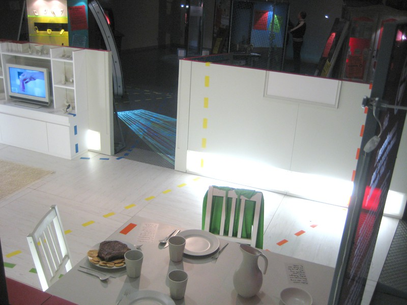
Imagen del montaje

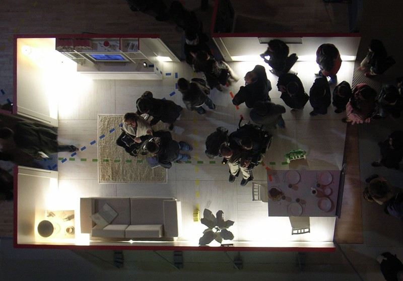
Imagen del montaje

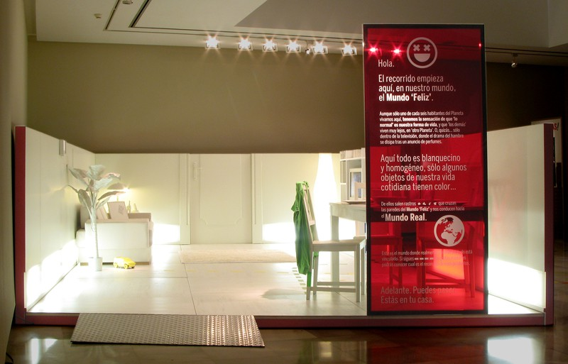
Imagen del montaje

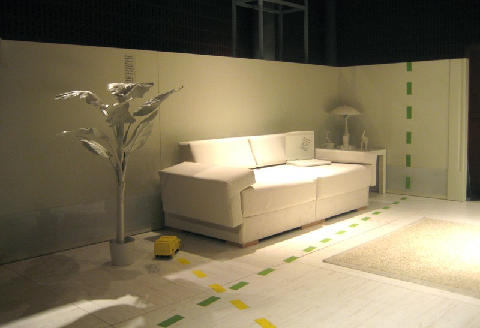
Imagen del montaje

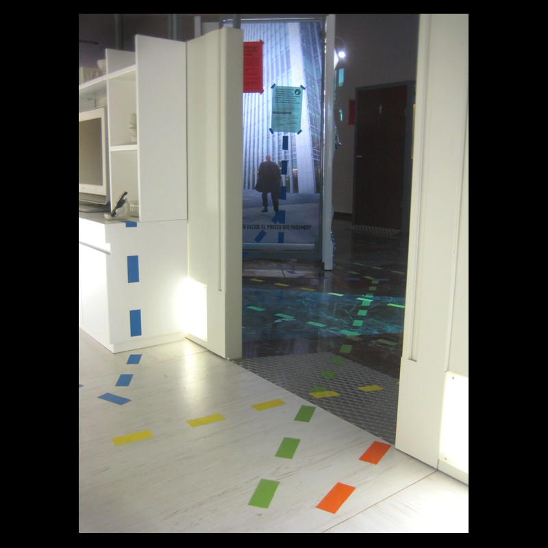
Imagen del montaje

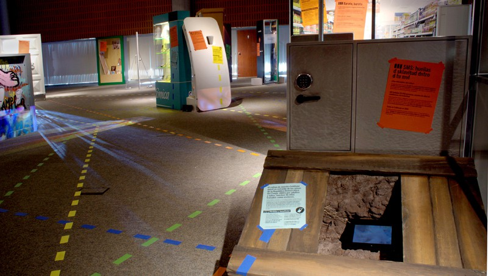
Imagen del montaje (foto de Marta Bujan)

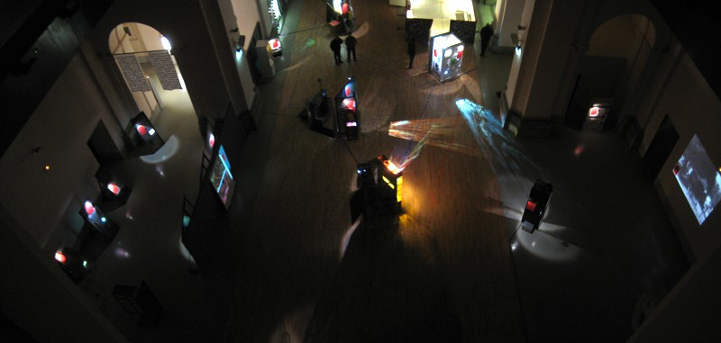
Imagen del montaje

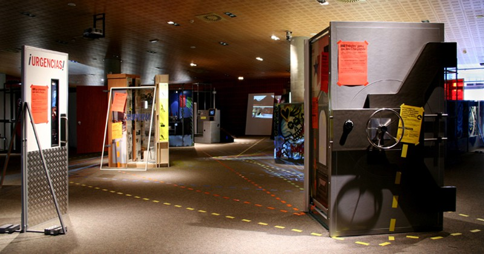
Imagen del montaje (foto de Marta Bujan)

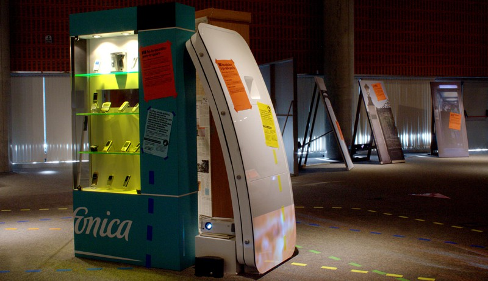
Imagen del montaje (foto de Marta Bujan)

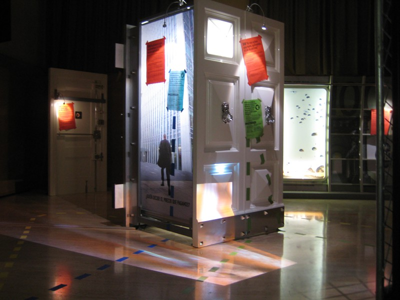
Imagen del montaje

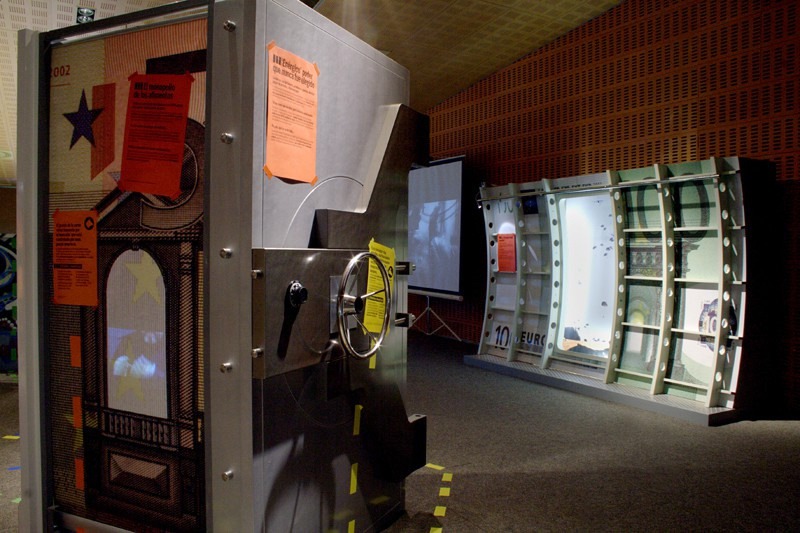
Imagen del montaje (foto de Marta Bujan)

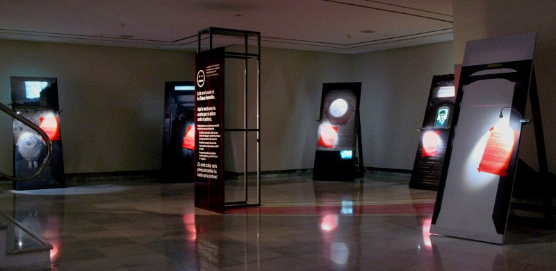
Imagen del montaje

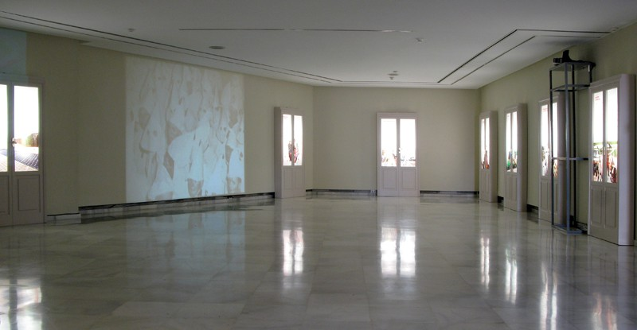
Imagen del montaje

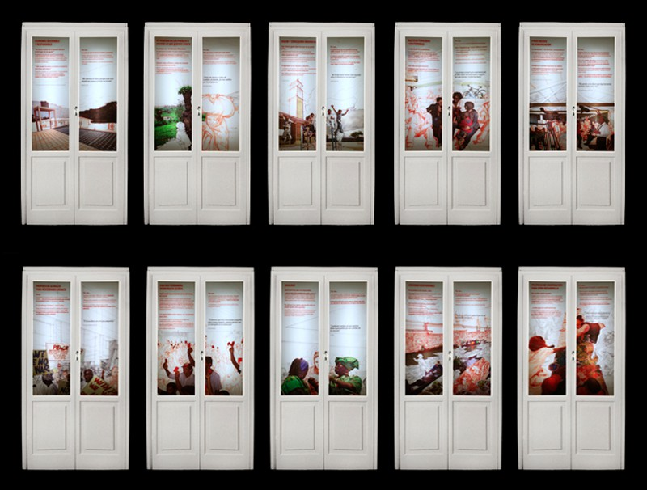
Puertas del Mundo Posible

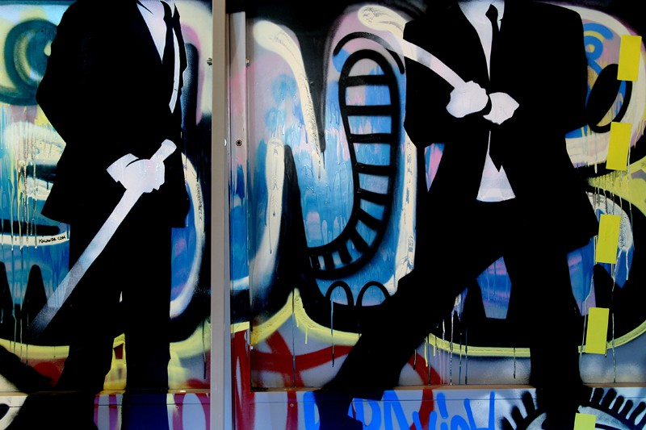
Detalle

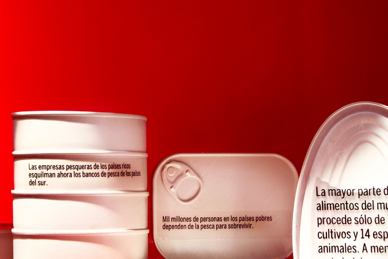
Detalle (foto de Marta Bujan)

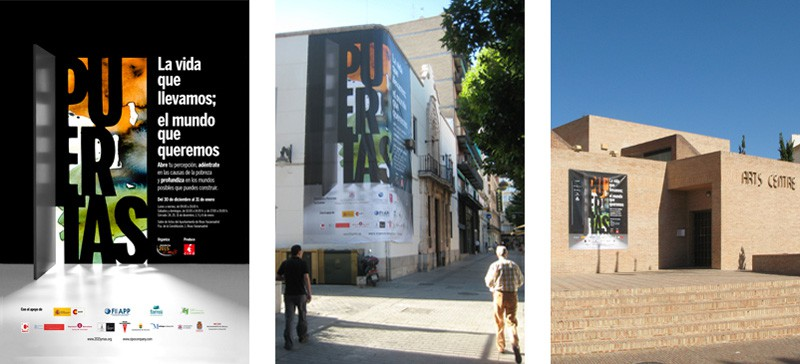
Carteles y exposición en Benalmádena
