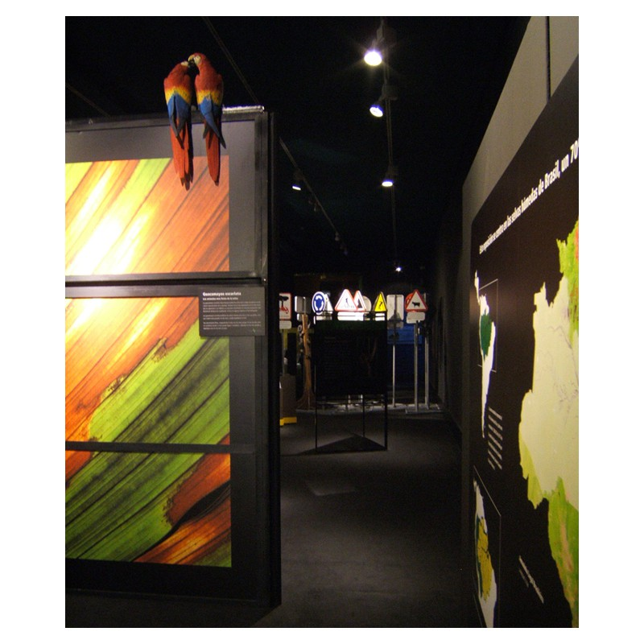

Diseño, dirección artística y coordinación de los montajes
Con Cipó Company
Diseño gráfico de Natalia De la Torre

- **Promotor**: Obra Social Caja Madrid
- **Lugares**: Jardines Botánicos de Madrid, Valencia, Córdoba y Malaga; Museo Arqueológico de Alicante (MARQ), Museo de las Ciencias de Valladolid, Museo Municipal de Lleida, Museo del Puerto de Tarragona, Museo del Calzado de Elda, Museo de la ciudad de Benicarló; salas de los ayuntamientos de Soria, Camponaraya, Campello, Burjassot y Torla; centros culturales Juan Carlos I de San Fernando de Henares, Jose Saramago de Leganés, Pablo Serrano de Getafe, Pablo Iglesias de San Sebastián de los Reyes y Federico García Lorca de Rivas Vacíamadrid; Planetario de Castellón, Centro de estudios medioambientales Cristina Enea de San Sebastian, Centro de estudios ambientales de Vitoria, Aula de naturaleza de la Diputación de Huesca, Iglesia de la Encarnación de Zamora, Auditorio Joaquín Rodrigo de Las Rozas, Foro Iberoamericano de Palos de la frontera y sala de la Obra Social Caja Madrid de Zaragoza

### Enlaces relacionados

- [Video resumen de la exposición](http://www.youtube.com/watch?v=XB5H5Vc9bmE)
- [Reportaje en TELEMADRID](http://www.youtube.com/watch?v=lOZOCkEe0PM)
- [La exposición en la web de CIPÓ](http://cipocompany.com/portfolios/planeta-amazonia/)
- [Artículo en ES POR MADRID](http://www.espormadrid.es/2009/03/planeta-amazonia-la-selva-virgen-mas.html)

Dibujos

Dibujo para el montaje en el Jardín Botánico de Madrid

Montaje en el Jardín Botánico de Madrid

Montaje en el Jardín Botánico de Madrid

Montaje en el Jardín Botánico de Valencia

Montaje en el Jardín Botánico de Valencia

Montaje en el Museo Arqueológico de Alicante

Montaje en la sala de la OSCM de Zaragoza

Montaje en la sala de la OSCM de Zaragoza

Detalle de un expositor

Detalle de un expositor

Catálogo y exposición en Madrid y Benicarló
