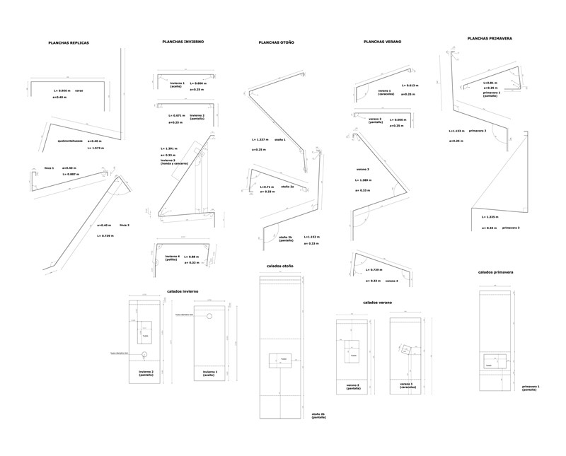
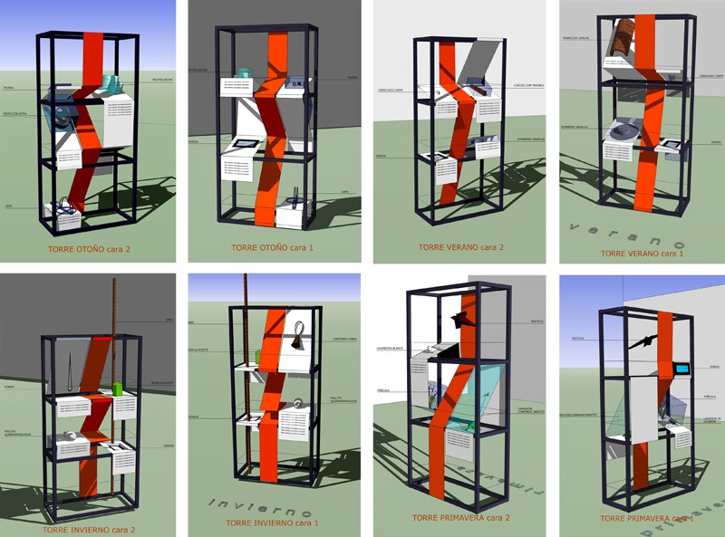
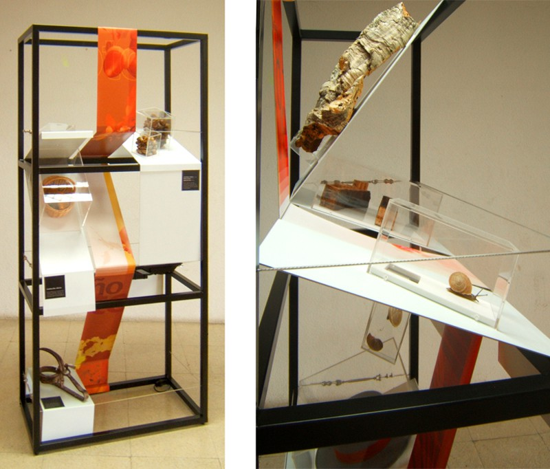
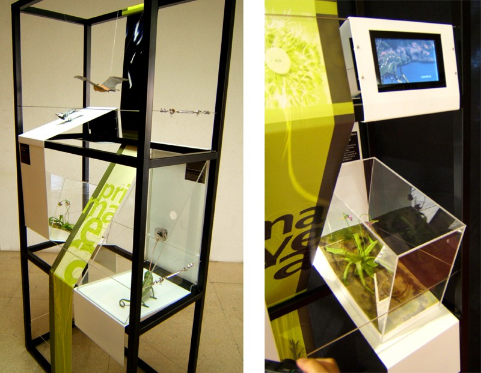
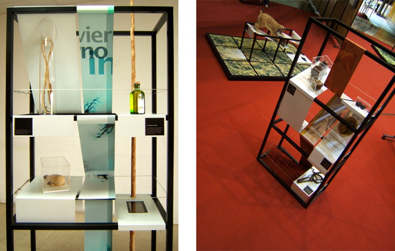
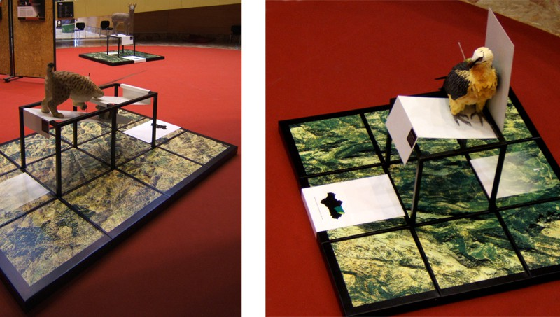
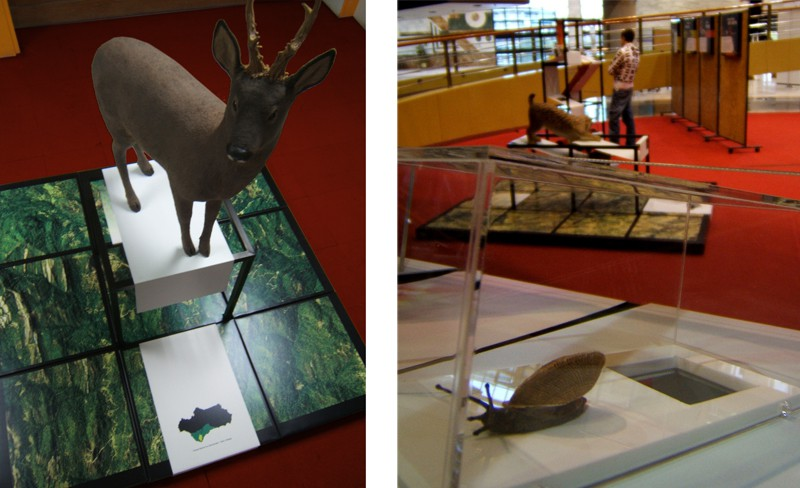
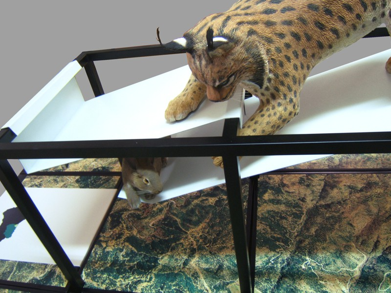
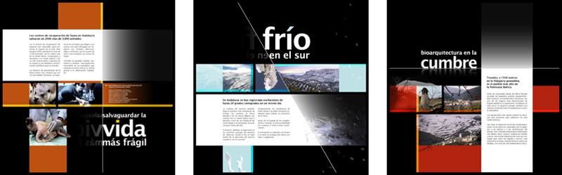

Diseño y dirección artística

Con Cipó Company

Diseño gráfico de Natalia De la Torre

- **Promotor**: Junta de Andalucía
- **Lugar**: Primer montaje en el Palacio de los Congresos de Granada

### Enlaces relacionados

- [La exposición en la web de CIPÓ](http://cipocompany.com/portfolios/tesoro-del-sur-3/)

Planos de las planchas metalicas

Dibujo para una hipótesis de montaje

Dibujos de las torres

Fotos del montaje

Fotos del montaje

Fotos del montaje

Fotos del montaje

Fotos del montaje

Detalle de una replica

Gráfica de la exposición
