Diseño y dirección artística de exposición y campaña
Con Cipó Company

- **Promotor**: ONGAWA
- **Lugares**: Campus EOI de Madrid, ICAI de Madrid…

### Enlaces relacionados

- [Video de CIPÓ para la campaña](http://www.youtube.com/watch?v=e0i95uQTEqY)
- [La exposición en la web de CIPÓ](http://cipocompany.com/portfolios/compromiso-desarrollo/)
- [Artículo en la web de ONGAWA](http://ongawa.org/wp/cyd/2011/06/10/335/)
- [Artículo en la web de EOI](http://www.eoi.es/portal/guest/evento/1942/exposicion-compromiso-y-desarrollo)
- [Fotografías en la galería de ONGAWA](http://www.flickr.com/photos/isfapd/6217260086/)
- [Artículo en el blog de ENCUENTRO DE PROYECTOS SOLIDARIOS](http://encuentroproyectossolidarios.wordpress.com/2011/11/04/muestra-del-programa-compromiso-y-desarrollo-de-ongawa-ingenieria-pra-el-desarrollo-en-el-encuentro-de-proyectos-solidarios/)

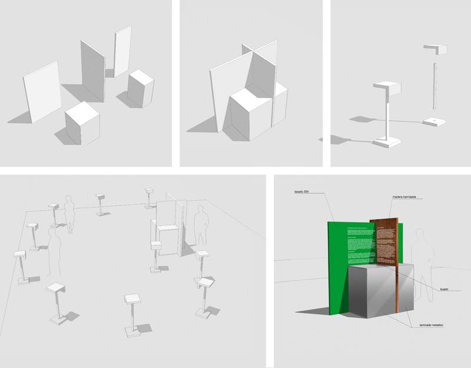
Dibujos

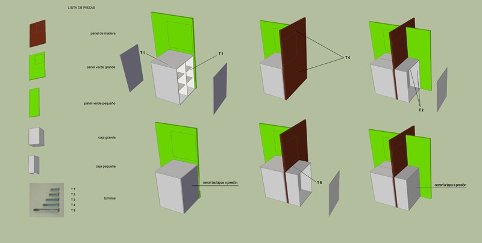
Indicaciones para el montaje

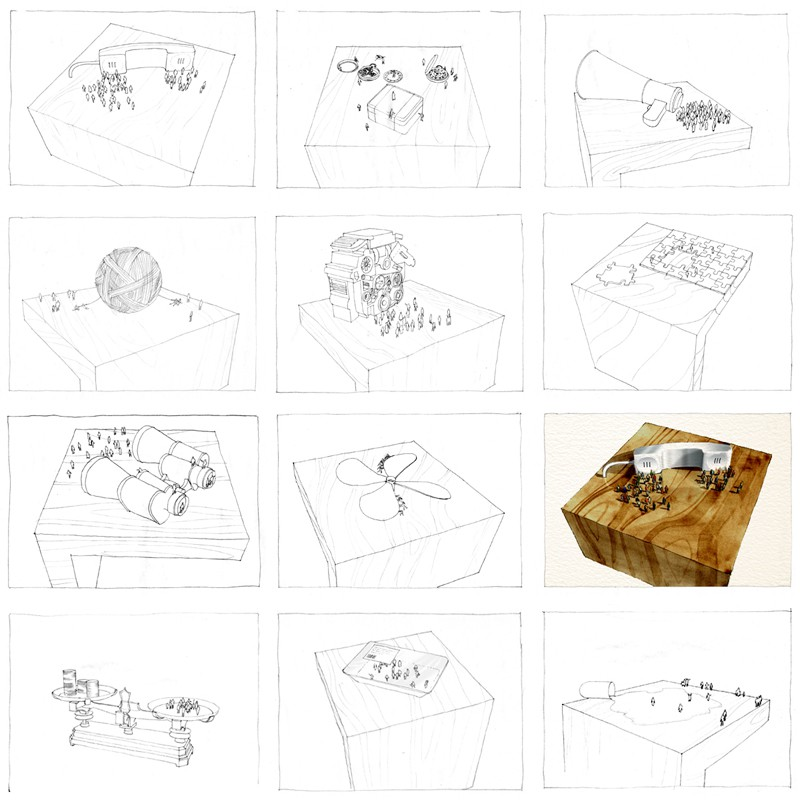
Dibujos para las maquetas

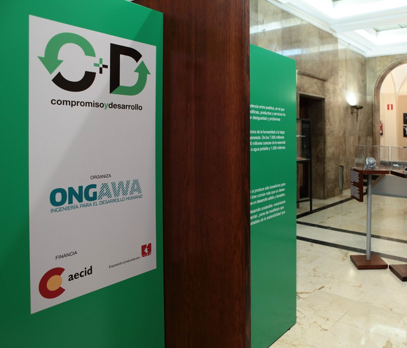
Foto del montaje (foto de ONGAWA)

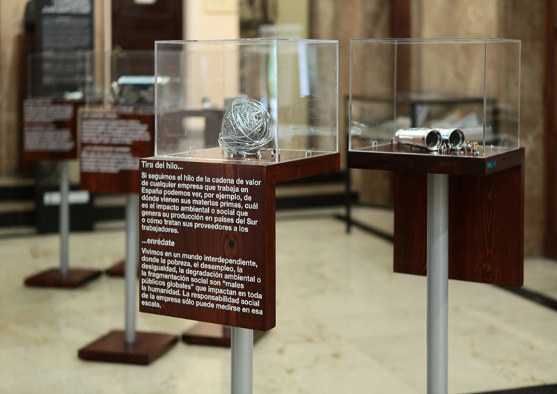
Foto del montaje (foto de ONGAWA)

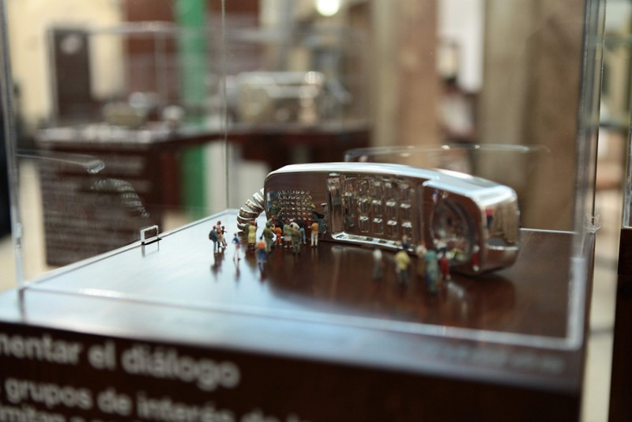
Foto del montaje (foto de ONGAWA)

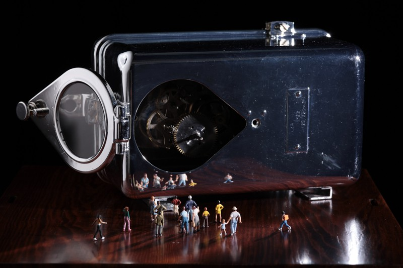
Detalle de una maqueta (foto de Daniel Ubeda)

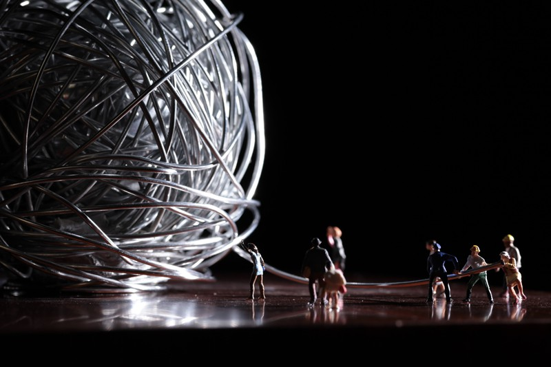
Detalle de una maqueta (foto de Daniel Ubeda)

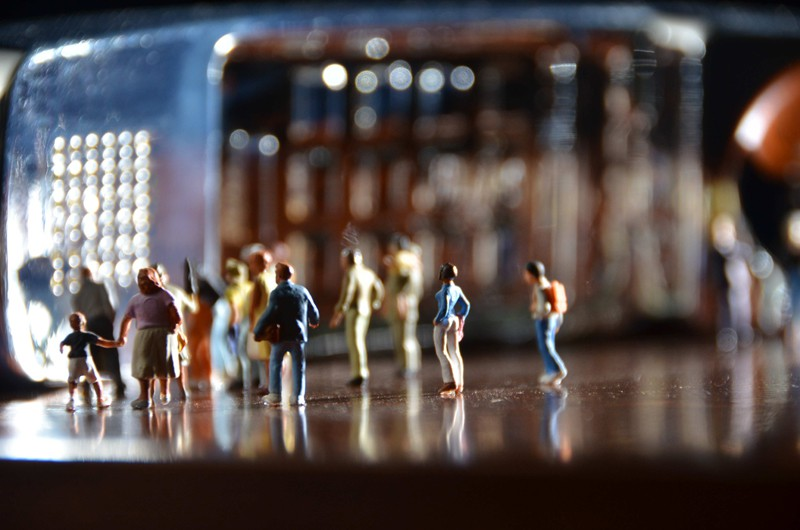
Detalle de una maqueta (foto de Daniel Ubeda)

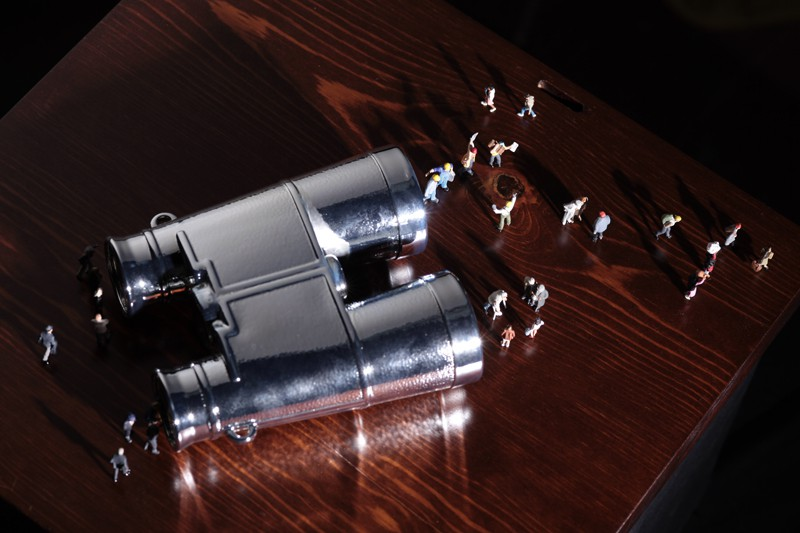
Detalle de una maqueta (foto de Daniel Ubeda)

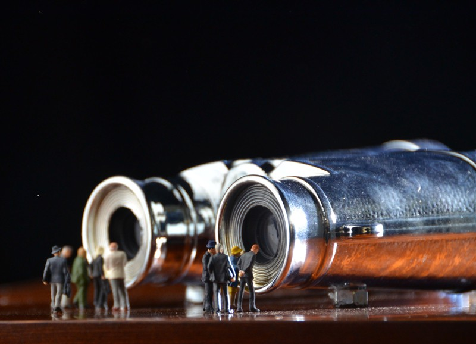
Detalle de una maqueta (foto de Daniel Ubeda)

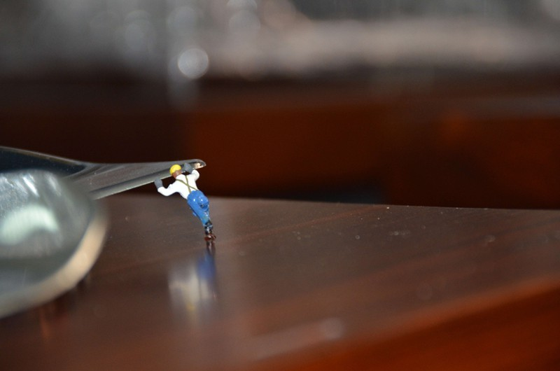
Detalle de una maqueta (foto de Daniel Ubeda)

Logotipo campaña
