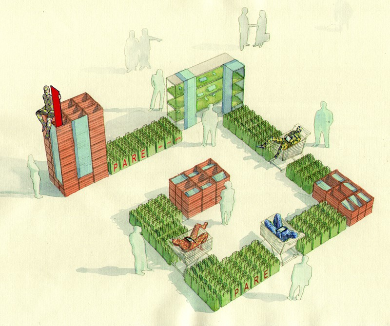
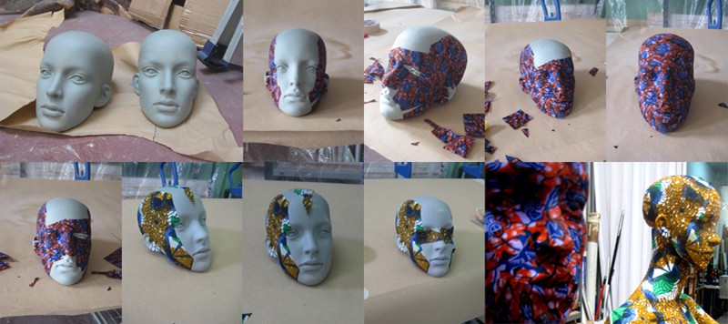
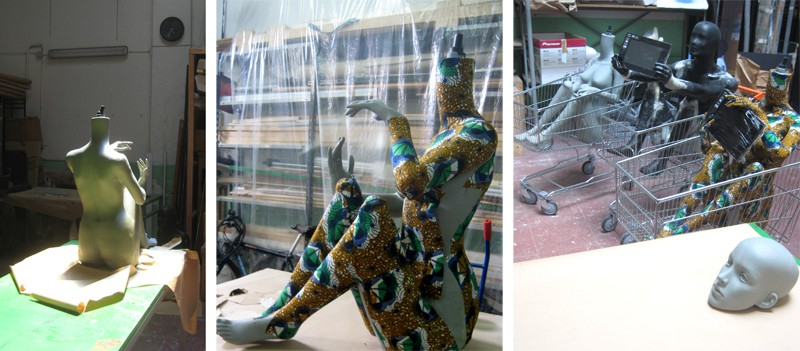
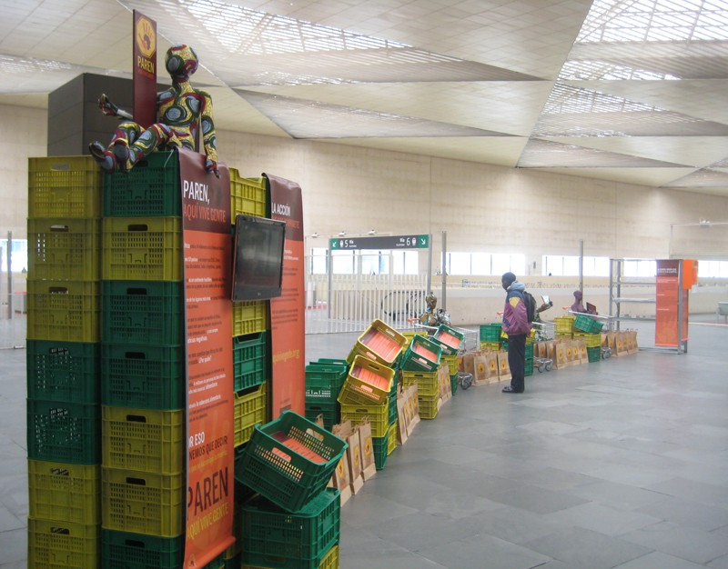
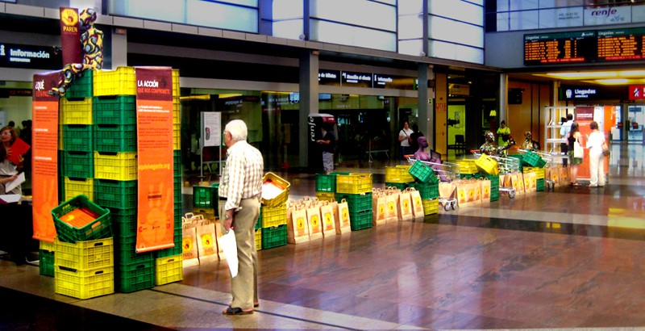
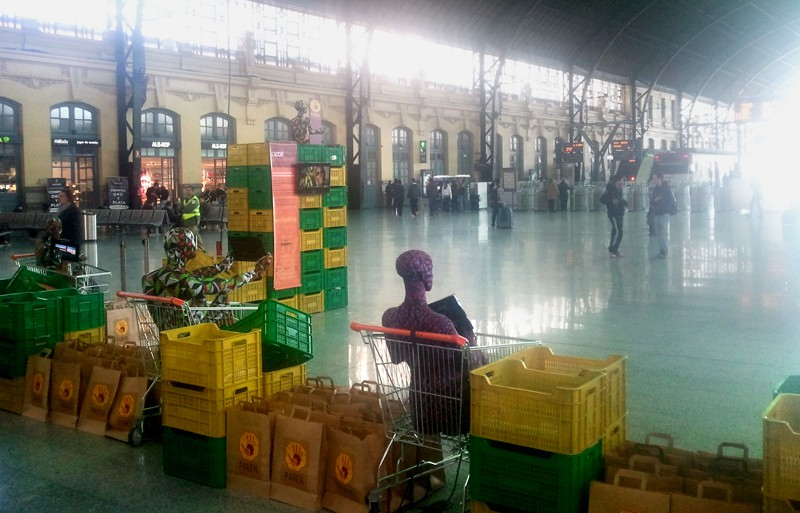
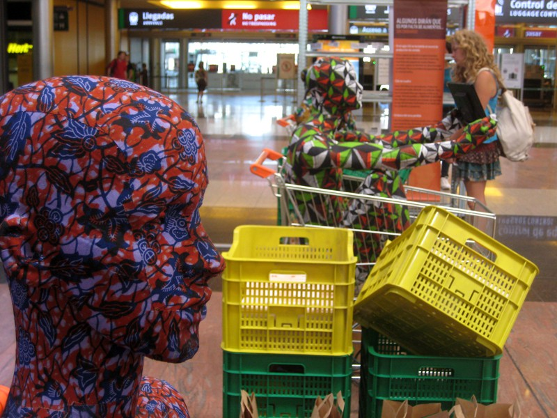
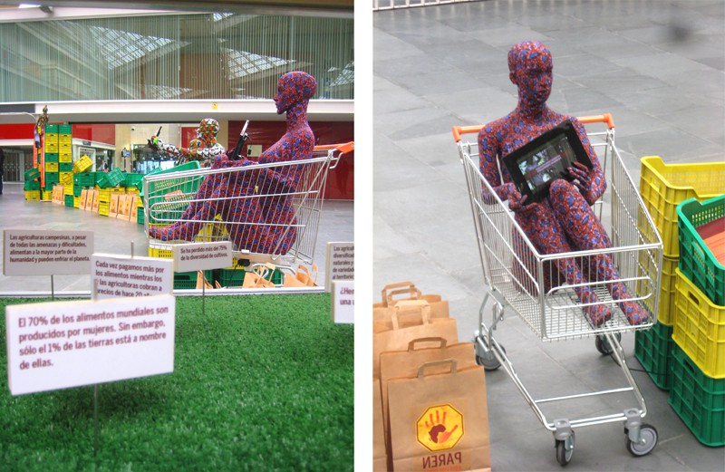
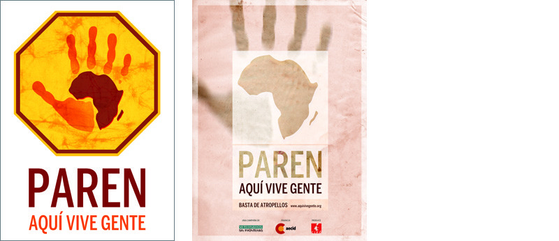

Diseño, dirección artística de la exposición y de la campaña y coordinación de los montajes

Con Cipó Company

- **Promotor**: Veterinarios Sin Fronteras
- **Lugares**: Alhondiga de Bilbao; Plaza Bonet i Muixí de Barcelona; estaciones de Chamartin en Madrid, Valencia Norte, Maria Zambrano de Malaga, Delicias de Zaragoza, Intermodal de Palma de Mallorca y León

### Enlaces relacionados

- [Reportaje en TVE](https://www.youtube.com/watch?v=No0x1WkEcn8)
- [Video del Flash Mob](http://www.youtube.com/watch?v=ZgWoO4Kn8YY)
- [Reportaje en RTVE Andalucía](http://www.youtube.com/watch?v=vqBSAPpf6FI)
- [La exposición en la web de CIPÓ](http://cipocompany.com/portfolios/paren-aqui-vive-gente/)

Dibujo general

La construcción de los maniquíes

La construcción de los maniquíes

Fotos del montaje en Zaragoza

Fotos del montaje en Malaga

Fotos del montaje en Valencia

Fotos del montaje en Bilbao

Fotos del montaje en Malaga

Detalle de una replica en Zaragoza

Logotipo y cartel de la campaña
