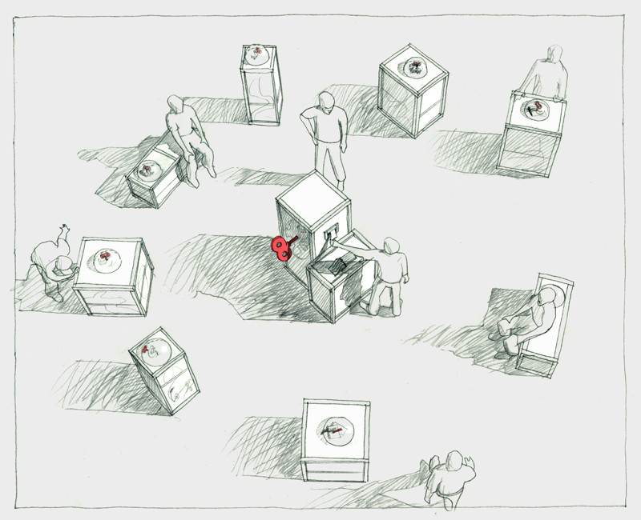
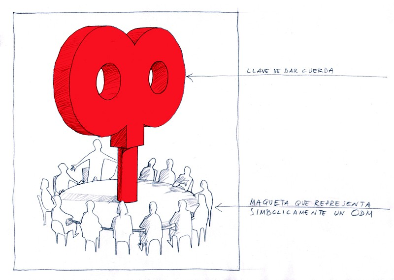
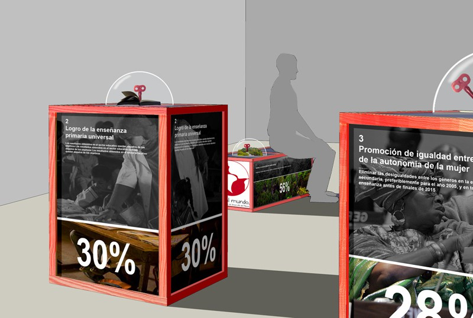
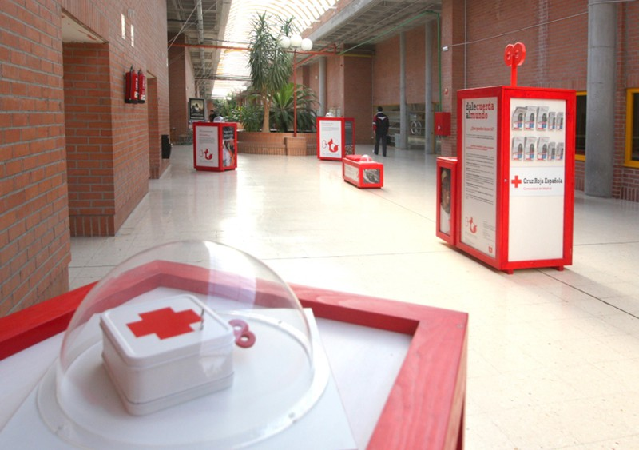
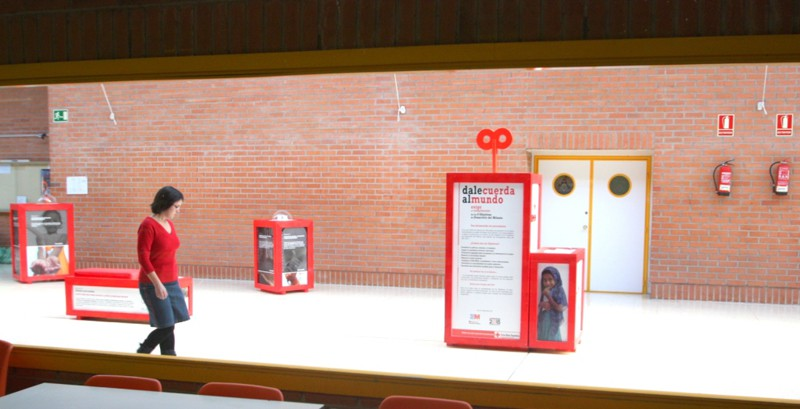
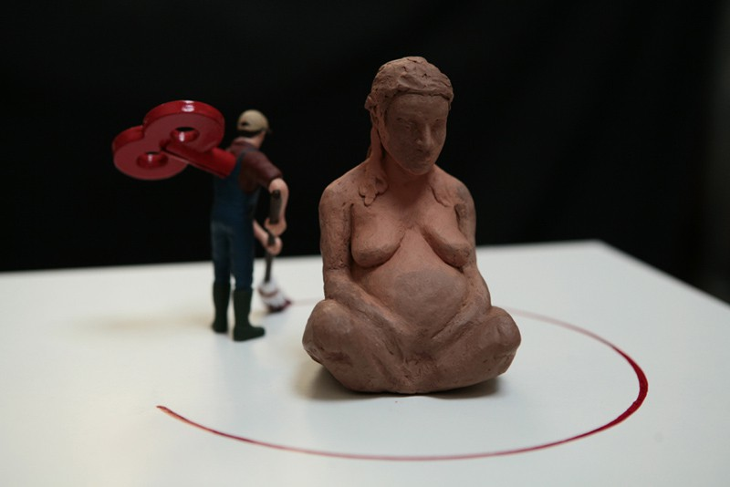
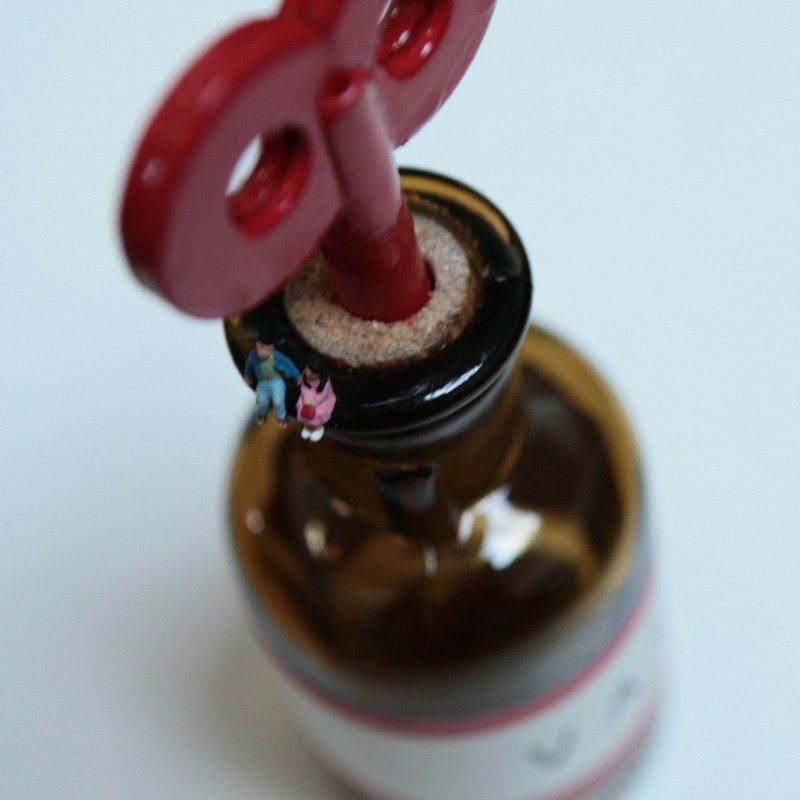
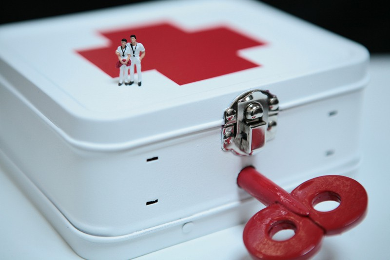
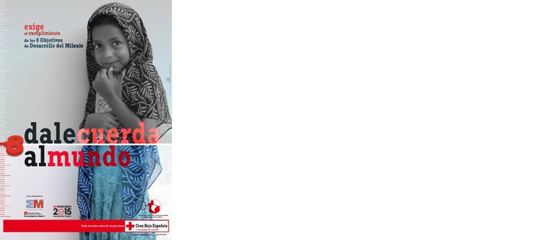

Diseño y dirección artística
Con Cipó Company

- **Promotor**: Cruz Roja Española
- **Lugares**: Facultad de Medicina de la Universidad de Alcalá de Henares, Espacio Pozas 14 en Madrid, Facultad de Ingeniería de la UAM,…

### Enlaces relacionados

- [La exposición en la web de CIPÓ](http://cipocompany.com/portfolios/dale-cuerda-al-mundo/)

Dibujo general

Dibujo para una maqueta

Dibujo de las cajas

Foto del montaje en Alcalá de Henares (foto de Angel Gordillo Jociles)

Foto del montaje en Alcalá de Henares (foto de Angel Gordillo Jociles)

Foto de una maqueta (foto de Daniel Ubeda)

Foto de una maqueta (foto de Daniel Ubeda)

Foto de una maqueta (foto de Daniel Ubeda)

Foto de una maqueta (foto de Daniel Ubeda)

Foto de una maqueta (foto de Daniel Ubeda)

Foto de una maqueta (foto de Daniel Ubeda)

Cartel de la campaña
