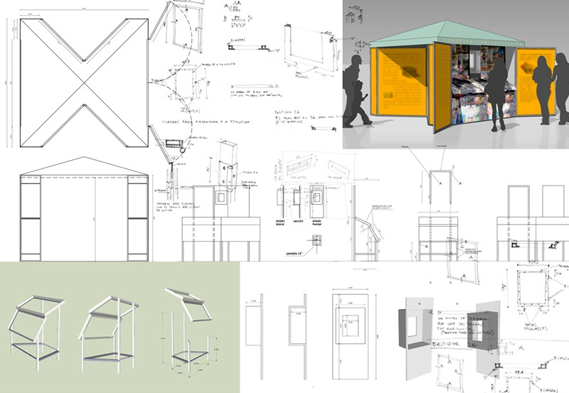
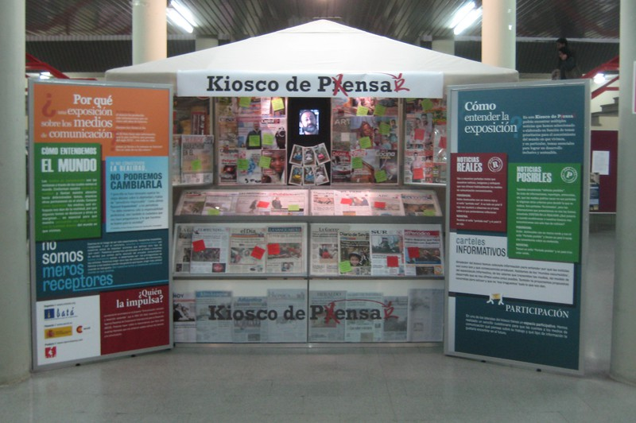
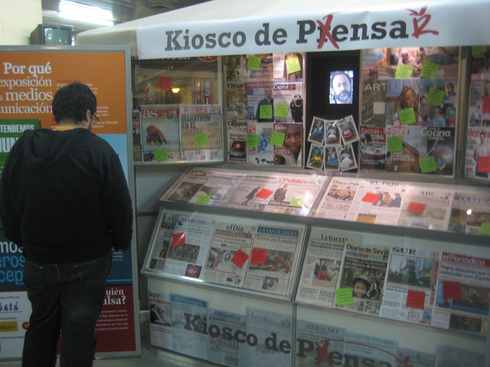
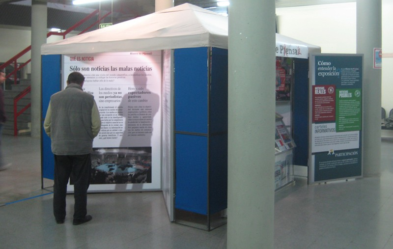
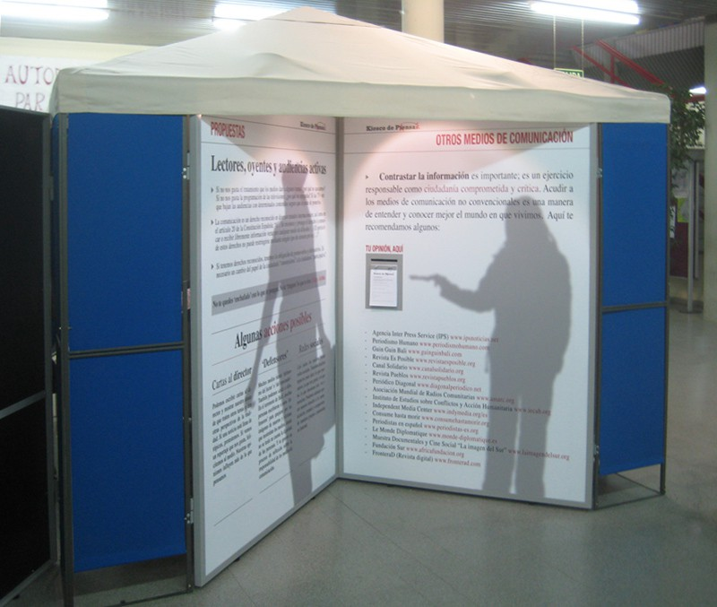
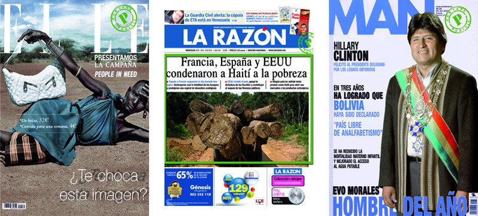

Diseño y dirección artística

Con Cipó Company

- **Promotor**: CIC BATA
- **Lugares**: Estación de Atocha, Facultad de Ciencias de la Educación de la Universidad de Córdoba,…

### Enlaces relacionados

- [Artículo en la web de CIC BATÁ](http://www.cicbata.org/?q=node/332)
- [Artículo en la web de CIC BATÁ](http://www.cicbata.org/?q=node/304)
- [Reportaje en RTVE](http://www.youtube.com/watch?v=qa210PqNw9E)
- [La exposición en la web de CIPÓ](http://cipocompany.com/portfolios/kiosko-de-pensar/)
- [Artículo en ENTRELINEAS](http://www.revistaentrelineas.es/21/entretemas/kiosko-de-pensar)
- [Artículo en APADRINO](http://apadrino.com/un-quiosco-para-pensar/)
- [Artículo en HUMANIA.TV](http://www.humania.tv/noticias/inauguracion_del_kiosco_de_pensar_en_la_estacion_de_atocha)
- [Artículo en BIBLIONEYRA](http://biblioneyra.blogspot.com.es/2011/06/kiosco-de-pensar-en-la-biblioteca.html)
- [Artículo en la web de la Universidad de Cordoba](http://www.uco.es/servicios/comunicacion/component/k2/item/72110-20110302)
- [Artículo en CANALSOLIDARIO.ORG](http://www.canalsolidario.org/notas/2760)

Dibujos

Foto del montaje en la Universidad de Cordoba

Foto del montaje en la Universidad de Cordoba

Foto del montaje en la Universidad de Cordoba

Foto del montaje en la Universidad de Cordoba

Indicaciones para el montaje

Revistas retocadas
