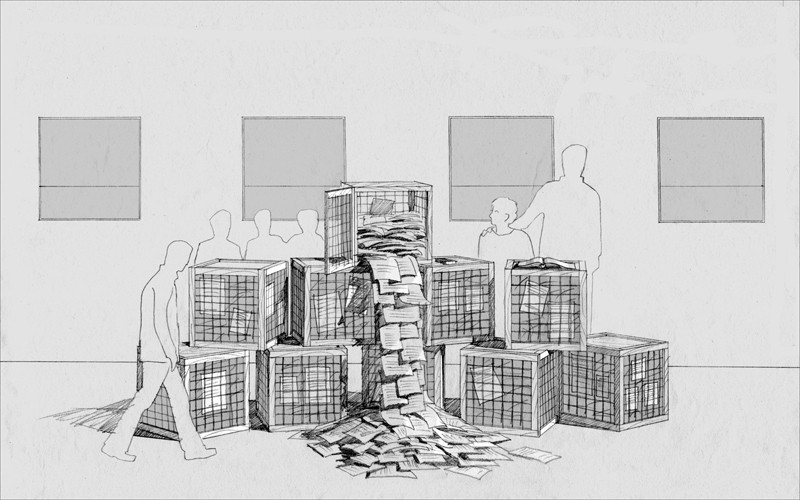
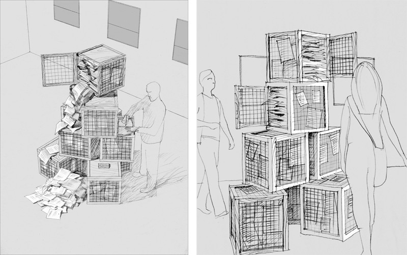
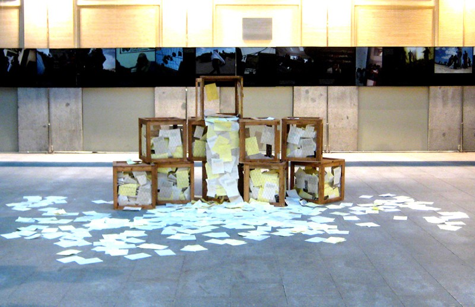
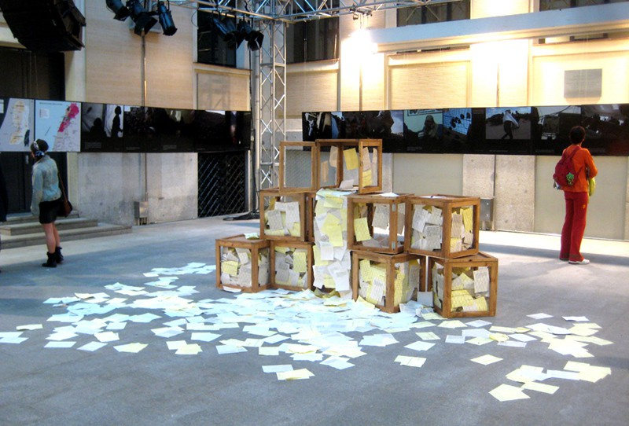
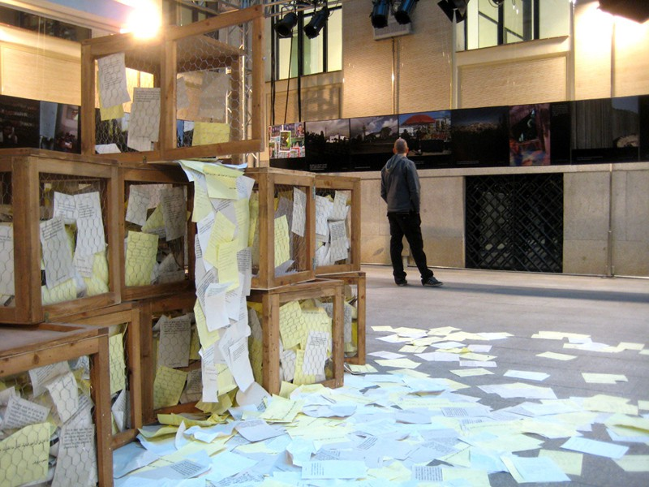
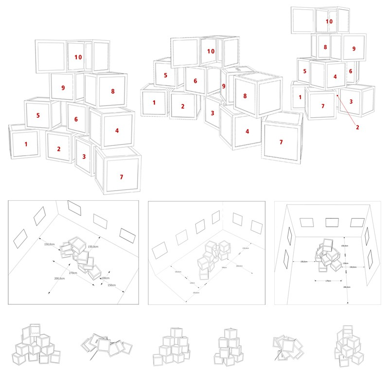
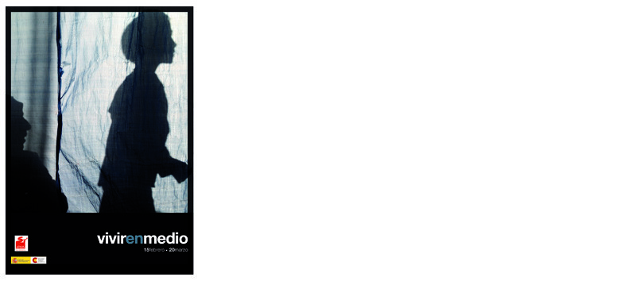

Diseño y dirección artística

Con Cipó Company

- **Promotor**: Solidaridad Internacional
- **Lugares**: Casa Encendida en Madrid, Casa de Cultura Villa Mercedes de Unquera (Cantabria), Sala Municipal de Torrejón de Ardoz, Polideportivo Municipal de Lobote (Logroño), Casa de la Cultura de Laviana (Asturias), Casa de la Cultura de Vejer de la Frontera (Cadiz), Universidad de Valladolid, Casa de Cultura de Val de San Vicente (Cantabria), Centro Cultural Blas de Otero en San Sebastián de los Reyes…

### Enlaces relacionados

- [Dossier en la web de S.I.](http://www.solidaridad.org/uploads/documentos/documentos_dossier_vivr_en_medio_8a245abf.pdf)
- [La exposición en la web de CIPÓ](http://cipocompany.com/portfolios/vivir-en-medio/)
- [Artículo en la web de GRUPO DE ONG POR PALESTINA](http://www.ongporpalestina.org/spip.php?article347)
- [Artículo en MADRIDPRESS.COM](http://www.madridpress.com/noticia/114607/)
- [Artículo en 20 MINUTOS](http://www.20minutos.es/noticia/680138/0/)

Dibujo

Dibujos

Foto del montaje en la Casa Encendida, Madrid

Foto del montaje en la Casa Encendida, Madrid

Foto del montaje en la Casa Encendida, Madrid

Indicaciones para el montaje

Cartel de la exposición
