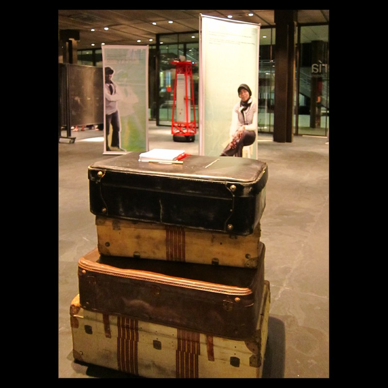

Diseño y dirección artística

Con Cipó Company

- **Promotor**: Habitafrica
- **Lugares**: Museo del traje de Madrid, teatro Francisco Rabal de Pinto, Sala del Ayuntamiento de Fuenlabrada, Casa de la Cultura de Miraflores de la Sierra, Centro Cultural Pablo Iglesias de Alcobendas, Espacio Cultural Volturno en Pozuelo de Alarcón…

### Enlaces relacionados

- [Artículo en la web de HABITAFRICA](http://noticias.habitafrica.org/voces-entre-dos-orillas-en-pinto-fuenlabrada-y-miraflores-de-la-sierra/)
- [La exposición en la web de CIPÓ](http://cipocompany.com/portfolios/voces/)
- [Reportaje en SERMADRIDNORTE.COM](http://www.youtube.com/watch?v=Cxucc3p1ft4)
- [Reportaje en MUNDONEGRODIGITAL](http://vimeo.com/31596643)
- [Reportaje en MUNDONEGRODIGITAL](http://vimeo.com/31241479)

Dibujos generales

Dibujos para la boya

Montaje en el Museo del Traje de Madrid

Montaje en el Museo del Traje de Madrid

Montaje en el Museo del Traje de Madrid
