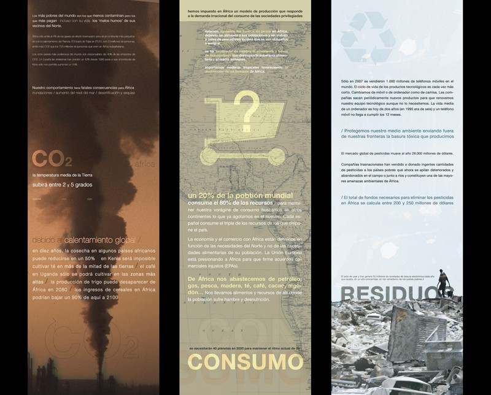
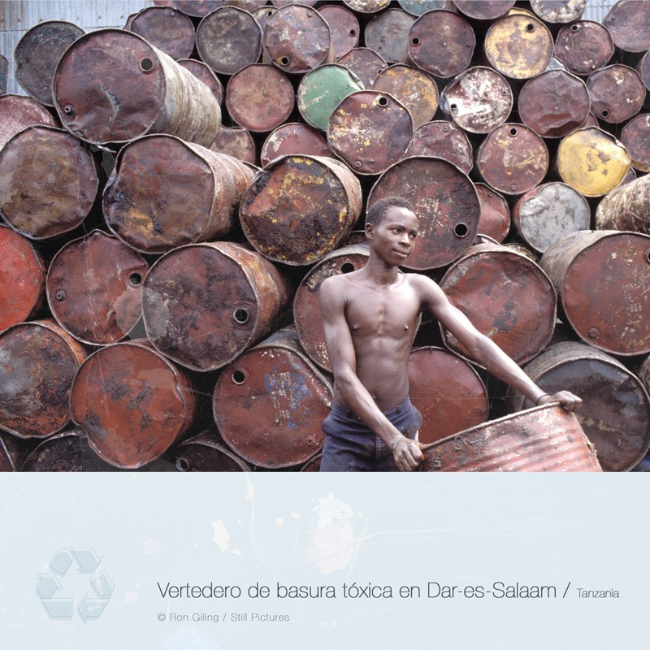

Diseño y dirección artística

Con Cipó Company

- **Promotor**: Fundación CEAR
- **Lugares**: Palacio de Congresos de Madrid, Sala Cero en Sevilla, Centro CulturalFederico García Lorca en Rivas Vaciamadrid, Centro Sociocultural de l’Eliana (Valencia)…

### Enlaces relacionados

- [La exposición en la web de CIPÓ](http://cipocompany.com/portfolios/refugiados-ambientales-refugiados-invisibles/)

Paneles de la exposición

Panel de la exposición
