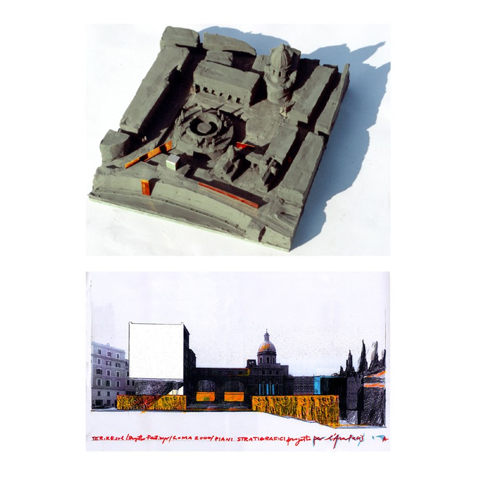
Instalación para la plaza Augusto Imperatore en Roma, con TER.RE. (1999)

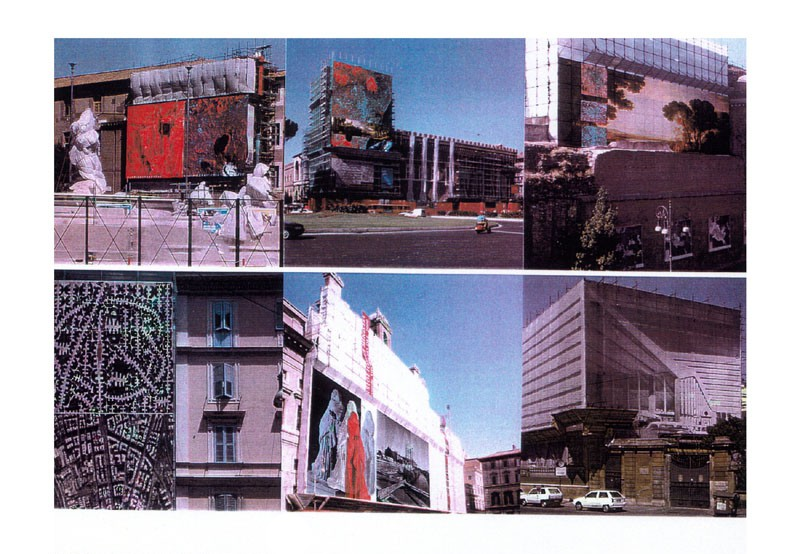
Proyecto Peutinger, para Roma, con TER.RE. (1999-2001)

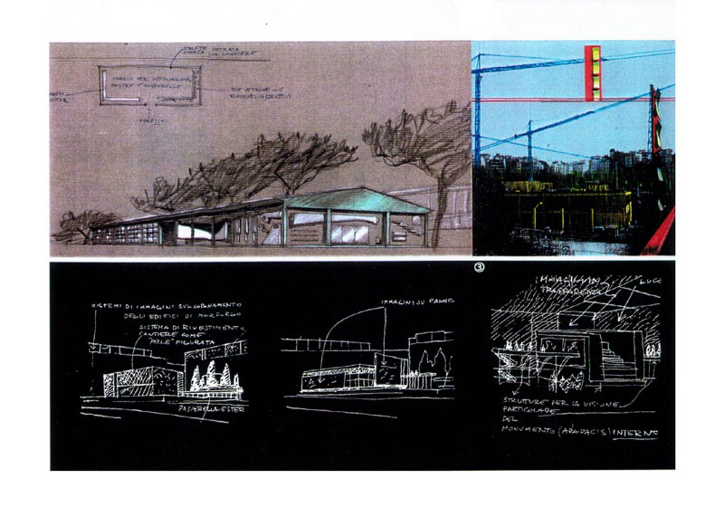
Instalaciones en las obras del auditórium y de la Ara Pacis en Roma, con TER.RE. (1999-2001)

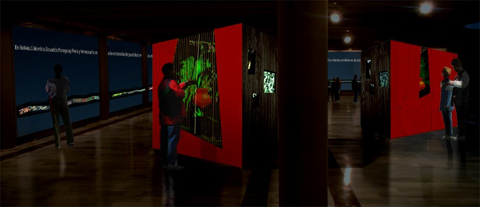
*Aislados,* para el Museo de la Ciudad de Madrid, con Cipó Company (2005)

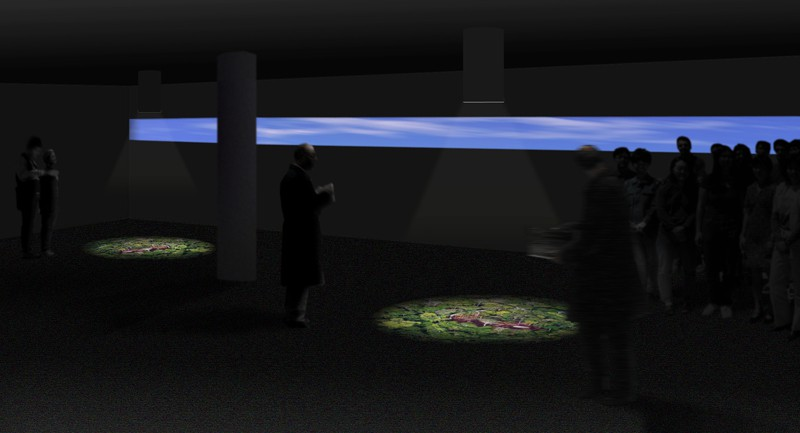
*Aislados,* para el Museo de la Ciudad de Madrid, con Cipó Company (2005)

Centro de interpretación para el jardín botánico de Malaga, con Cipó Company (2008)

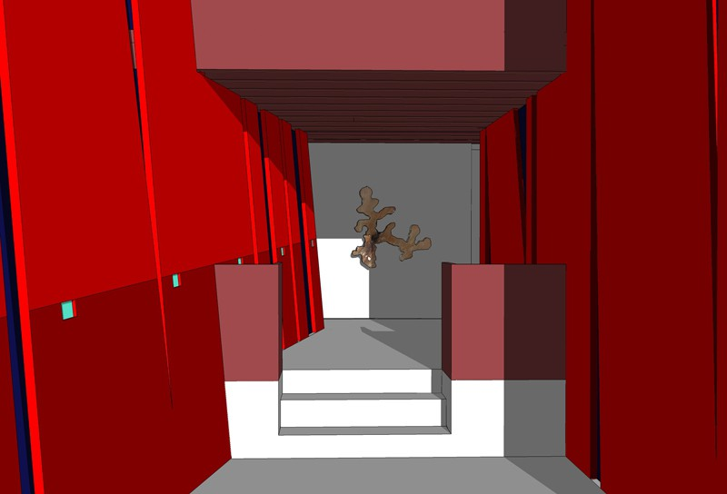
Centro de interpretación para el jardín botánico de Malaga, con Cipó Company (2008)

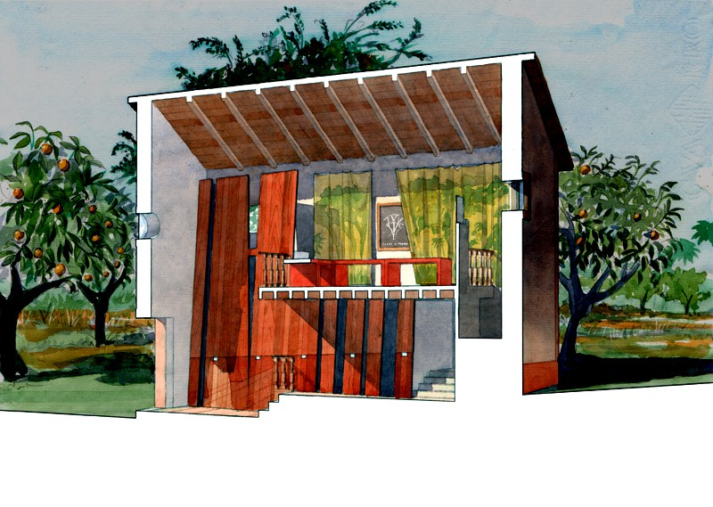
Centro de interpretación para el jardín botánico de Malaga, con Cipó Company (2008)

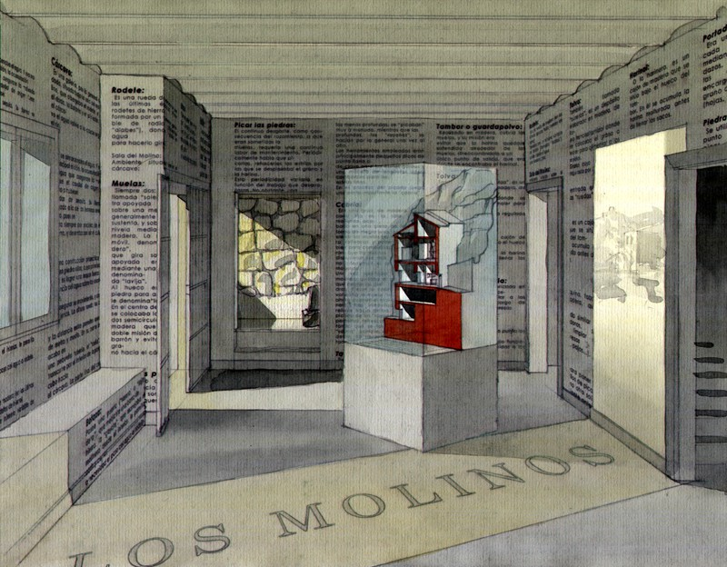
Centro de interpretación de Los Molinos de la Cuenca del Río de la Vega en Cazorla, con Cipó Company (2008)

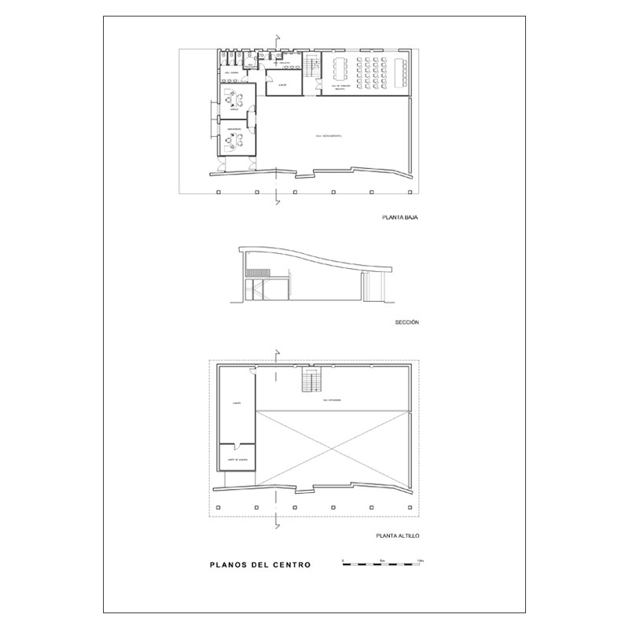
Centro de sensibilización de las energías renovables de la Comunitat Valenciana en Todolella, con Cipó Company (2006)

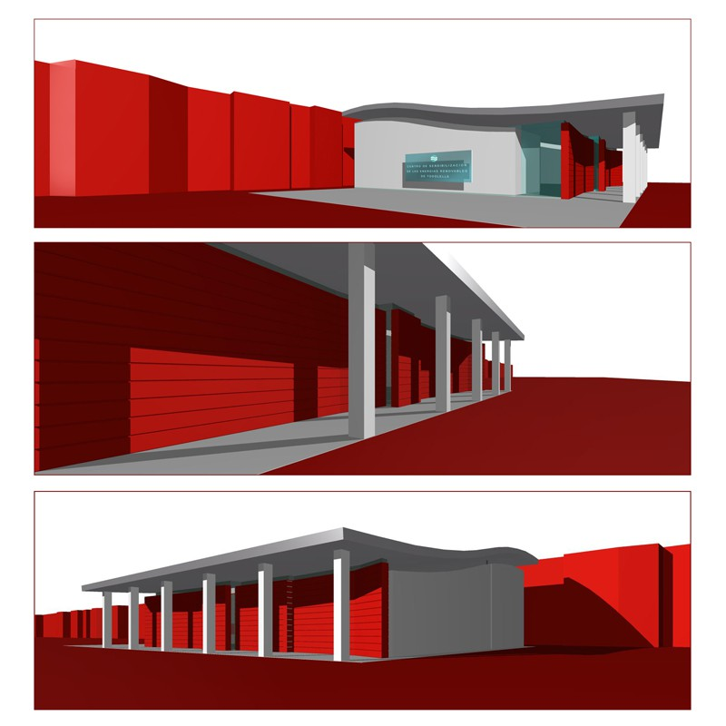
Centro de sensibilización de las energías renovables de la Comunitat Valenciana en Todolella, con Cipó Company (2006)

Centro de sensibilización de las energías renovables de la Comunitat Valenciana en Todolella, con Cipó Company (2006)

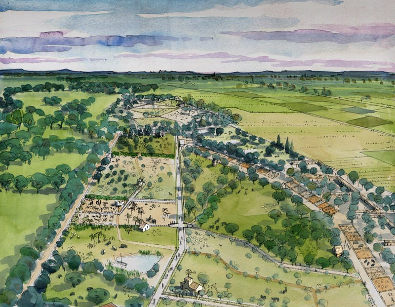
Centro de interpretación y parque - reserva de "El Encín" en Alcalá de Henares, con Cipó Company (2005)

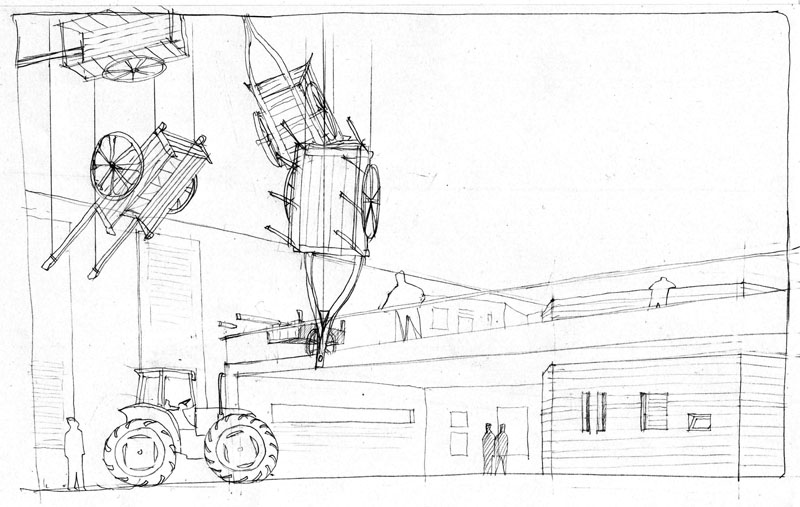
Centro de interpretación y parque - reserva de "El Encín" en Alcalá de Henares, con Cipó Company (2005)

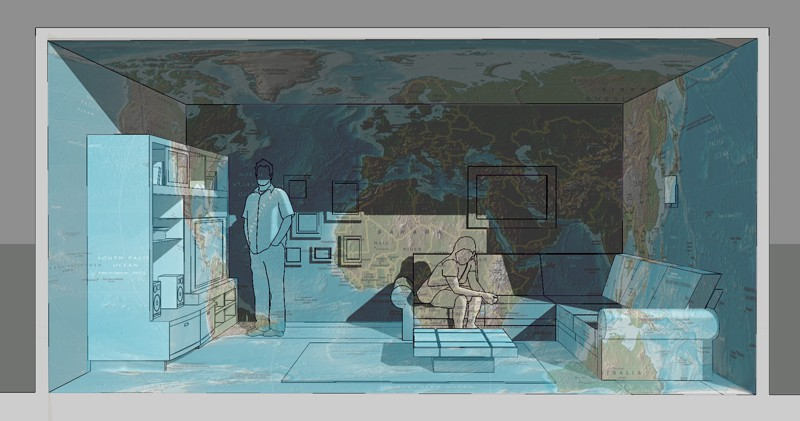
Box itinerante para AECID, con Cipó Company (2010)

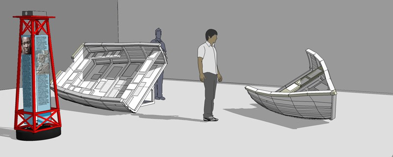
*Voces entre dos orillas* (versión 1) , para Habitafrica, con Cipó Company (2010)

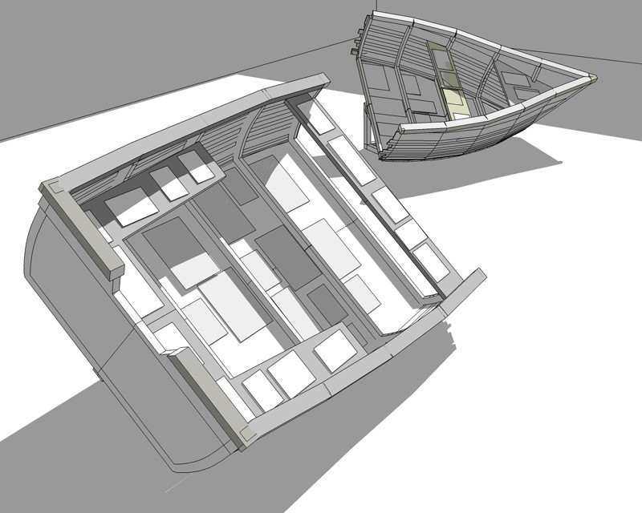
*Voces entre dos orillas* (versión 1) , para Habitafrica, con Cipó Company (2010)

*Tropicus*, para el Centro Cultural Galileo Galilei de Madrid, con Cipó Company (2009)

*Tropicus*, para el Centro Cultural Galileo Galilei de Madrid, con Cipó Company (2009)
