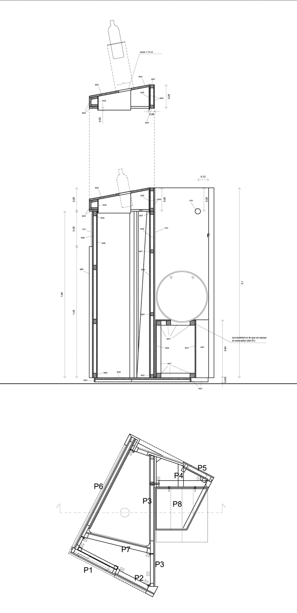

Diseño, dirección artística y coordinación de los montajes

Con Cipó Company

- **Promotor**: Obra Social *La Caixa*
- **Lugares**: Caixa Forum de Barcelona, Palma de Mallorca, Madrid, Tarragona, Lleida, Zaragoza y Girona

## Enlaces relacionados

- [Reportaje RTVE](http://www.rtve.es/alacarta/videos/para-todos-la-2/para-todos-2-entrevista-jose-maria-medina/2418596/)
- [La exposición en la web de Cipó](http://cipocompany.com/portfolios/inventos-ideas-que-cambian-vidas/)
- [Reportaje en ABC](http://www.abc.es/videos-cultura/20131008/caixaforum-barcelona-acoge-exposicion-2729962993001.html)
- [Reportaje en El Mundo](http://www.elmundo.es/baleares/2014/03/27/5333f17c22601d45208b456f.html)
- [Reportaje en El Periodico](http://www.elperiodico.com/es/noticias/barcelona/inventos-salvan-vidas-2730002)
- [Video Europapress](http://www.youtube.com/watch?v=5u4oMpr3WOk)
- [Video en Barcelona Cultura](http://barcelonacultura.bcn.cat/es/cultura-tv/inventos.-ideas-de-cambian-vidas)
- [Reportaje en Diario Design](http://diariodesign.com/2013/11/inventos-ideas-que-cambian-vidas-una-exposicion-de-obra-social-la-caixa-sobre-el-diseno-mas-solidario/)

Dibujos

Planos

Planos

Planos

Planos

Planos

Dibujo para el montaje en la sala de Barcelona

Foto del montaje en Palma de Mallorca

Foto del montaje en Palma de Mallorca

Foto del montaje en Palma de Mallorca

Foto del montaje en Palma de Mallorca

Foto del montaje en Palma de Mallorca

Cartel acceso y decoración del taller infantil
