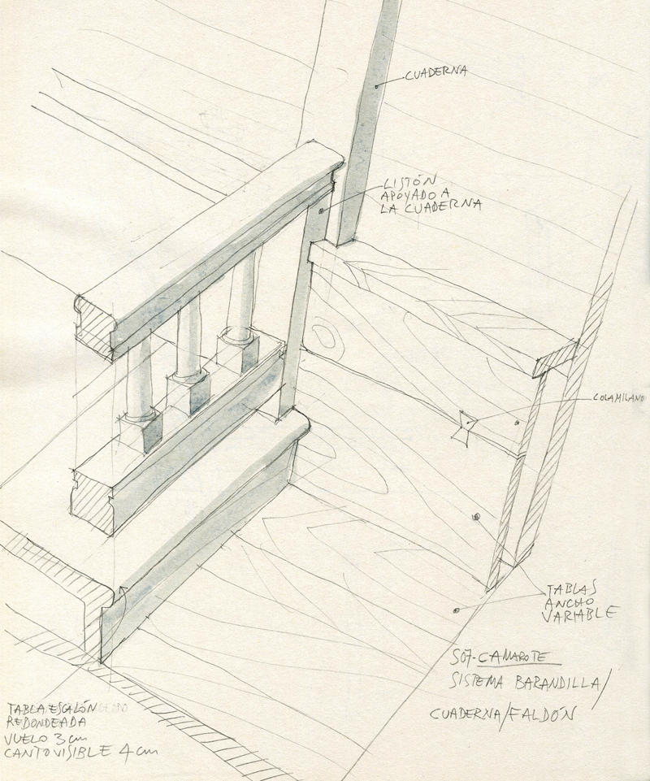

Diseño y dirección de construcción y montaje

Decoradora Pilar Revuelta

- **Promotor**: Puy du Fou
- **Lugar**: Toledo

### Enlaces relacionados

- [Pagina Puy du Fou España](https://www.puydufou.com/espana/es)
- [Tráiler Puy du Fou España](https://www.youtube.com/watch?v=ach8HOQMtEM)
- [Wikipedia](https://es.wikipedia.org/wiki/Puy_du_Fou_Espa%C3%B1a)

Dibujos

Dibujo para la sala de los monstruos

Dibujo para la sala de los monstruos

Foto de la sala de los monstruos

Planos de la popa de la Santa Maria

Detalles de la popa de la Santa Maria

Foto de la popa de la Santa Maria

Croquis de la entrada de la Santa Maria

Croquis de la entrada de la Santa Maria

Croquis de la entrada de la Santa Maria

Foto de la entrada de la Santa Maria

Croquis del camarote de Colón

Foto del camarote de Colón

Detalle para el camarote de Colón

Croquis de la sala de viveres

Foto de la sala de viveres

Croquis de la sala del diario de a bordo

Croquis de la sala del diario de a bordo

Detalle del mástil mayor

Croquis del mástil mayor

Foto de la sala del *diario de a bordo*

Foto de la sala del *diario de a bordo*

Croquis de la sala del *murmullo*

Croquis de la sala del *murmullo*

Croquis de la sala del *murmullo*

Detalle de las mensulas

Foto de la sala del *murmullo*

Foto de la sala del *murmullo*

Croquis de la sala *luces del horizonte*

Detalle para la sala *luces del horizonte*

Foto de la sala *luces del horizonte*

Croquis para la sala *Mar de Sargazos*

Detalle para la sala *Mar de Sargazos*

Croquis para la sala *Mar de Sargazos*

Foto de la sala *Mar de Sargazos*

Croquis del corredor

Croquis del corredor

Foto del corredor

Foto del corredor

Croquis de la sala *Ex voto*

Foto de la sala *Ex voto*

Croquis de la sala *¡Tierra, tierra!*

Foto de la sala *¡Tierra, tierra!*

Foto de la sala *¡Tierra, tierra!*

Planta del *Nuevo Mundo*

Alzado de la proa de la Santa Maria

Construcción de la proa de la Santa Maria

Montaje de la proa de la Santa Maria

Croquis para la salida al *Nuevo Mundo*

Croquis para la salida al *Nuevo Mundo*

Croquis para la salida al *Nuevo Mundo*

Foto de la salida al *Nuevo Mundo*

Foto de la salida al *Nuevo Mundo*

Diseños de atrezzo
