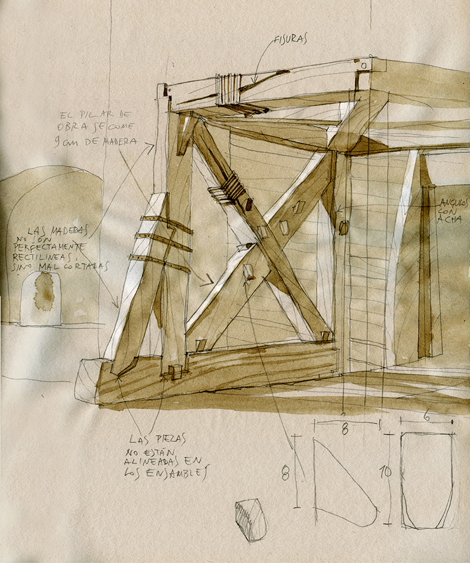
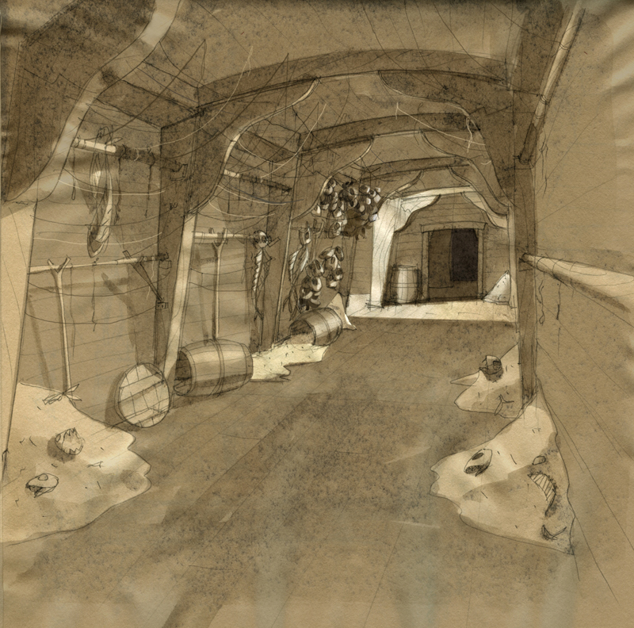
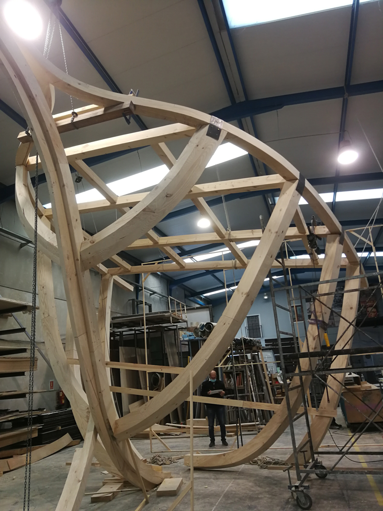

Diseño y dirección de construcción y montaje

Decoradora Pilar Revuelta

- **Promotor**: Puy du Fou
- **Lugar**: Toledo

### Enlaces relacionados

- [Pagina Puy du Fou España](https://www.puydufou.com/espana/es)
- [Tráiler Puy du Fou España](https://www.youtube.com/watch?v=ach8HOQMtEM)
- [Wikipedia](https://es.wikipedia.org/wiki/Puy_du_Fou_Espa%C3%B1a)

Dibujos

Dibujo para la sala de los monstruos

Dibujo para la sala de los monstruos

Foto de la sala de los monstruos

Planos de la popa de la Santa Maria

Detalles de la popa de la Santa Maria

Fto de la popa de la Santa Maria

Croquis de la entrada en la Santa Maria

Croquis de la entrada en la Santa Maria

Croquis de la entrada en la Santa Maria

Foto de la entrada en la Santa Maria

Croquis del camarote de Cristobal Colón

Foto del camarote de Cristobal Colón

Croquis detalle del camarote de Cristobal Colón

Croquis de la sala "Viveres"

Foto de la sala "Viveres"

Croquis de las sala "Jornal de a bordo"

Croquis de las sala "Jornal de a bordo"

Planos del mástil mayor

Croquis del mástil mayor

Foto de las sala "Jornal de a bordo"

Foto de las sala "Jornal de a bordo"

Croquis de la sala del "murmullo"

Croquis de la sala del "murmullo"

Croquis de la sala del "murmullo"

Croquis de una mensula

Foto de la sala del "murmullo"

Foto de la sala del "murmullo"

Croquis de la sala "Luces al horizonte"

Croquis de la sala "Luces al horizonte"

Foto de la sala "Luces al horizonte"

Croquis de la sala "Sargazos"

Planos de la torre grua

Croquis de la torre grua

Foto de la torre grua

Croquis del corredor

Croquis del corredor

Foto del corredor

Foto del corredor

Croquis de la sala "Ex voto"

Foto de la sala "Ex voto"

Croquis de la sala "¡Tierra, tierra!"

Foto de la sala "¡Tierra, tierra!"

Foto de la sala "¡Tierra, tierra!"

Planta del "Nuevo Mundo"

Alzado de la proa en el "Nuevo Mundo"

Foto de la construcción de la proa

Foto del montaje de la proa

Croquis del interior de la proa

Croquis del interior de la proa

Croquis del playa

Foto del interior de la proa

Foto de la playa

Varios dibujos de atrezzo
