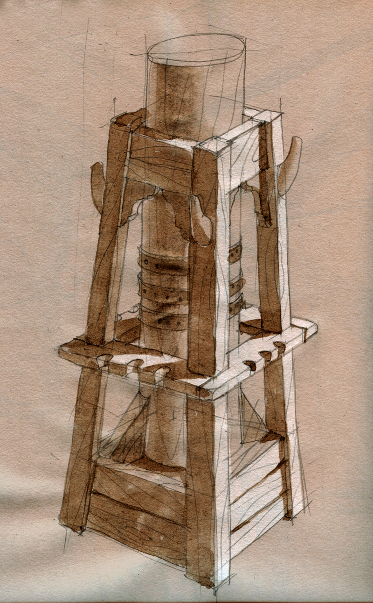

Diseño y dirección de construcción y montaje

Decoradora Pilar Revuelta

- **Promotor**: Puy du Fou
- **Lugar**: Toledo

### Enlaces relacionados

- [Pagina Puy du Fou España](https://www.puydufou.com/espana/es)
- [Tráiler Puy du Fou España](https://www.youtube.com/watch?v=ach8HOQMtEM)
- [Wikipedia](https://es.wikipedia.org/wiki/Puy_du_Fou_Espa%C3%B1a)

Dibujos

Dibujo para la sala de los monstruos

Dibujo para la sala de los monstruos

Foto de la sala de los monstruos

Planos de la popa de la Santa Maria

Detalles de la popa de la Santa Maria

Foto de la popa de la Santa Maria

Croquis de la entrada de la Santa Maria

Croquis de la entrada de la Santa Maria

Croquis de la entrada de la Santa Maria

Foto de la entrada de la Santa Maria

Croquis del camarote de Colón

Foto del camarote de Colón

Detalle para el camarote de Colón

Croquis de la sala de viveres

Foto de la sala de viveres

Croquis de la sala del diario de a bordo

Croquis de la sala del diario de a bordo

Detalle del mástil mayor

Croquis del mástil mayor

Foto de la sala del diario de a bordo

Foto de la sala del diario de a bordo

Croquis de la sala del murmullo

Croquis de la sala del murmullo

Croquis de la sala del murmullo

Detalle de las mensulas

Foto de la sala del murmullo

Foto de la sala del murmullo

Croquis de la sala *luces del horizonte*

Detalle del mástil mayor

Detalle del mástil mayor

Detalle del mástil mayor

Detalle del mástil mayor

Detalle del mástil mayor

Detalle del mástil mayor

Detalle del mástil mayor
