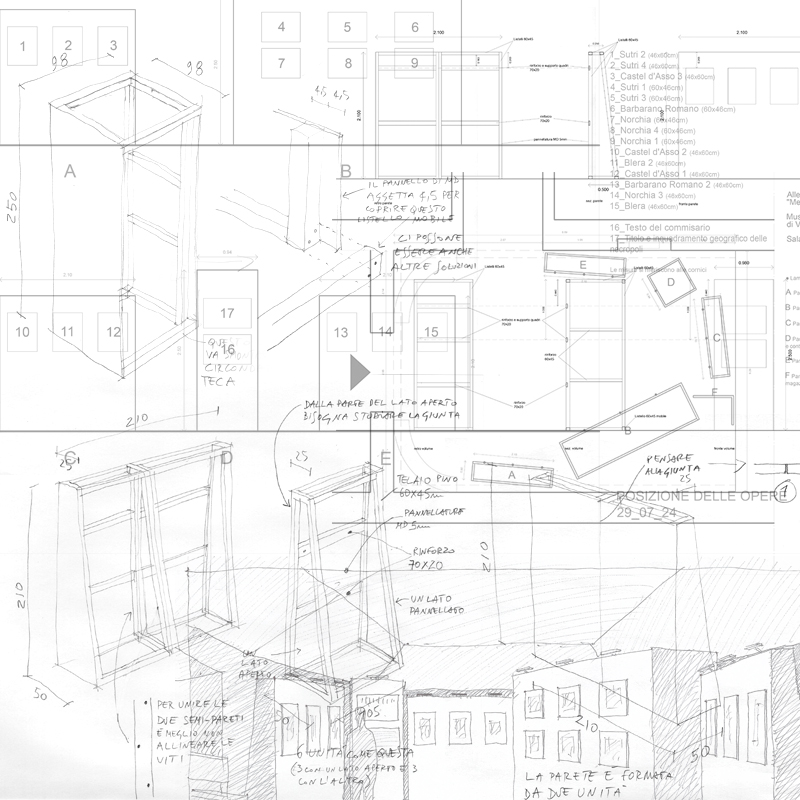
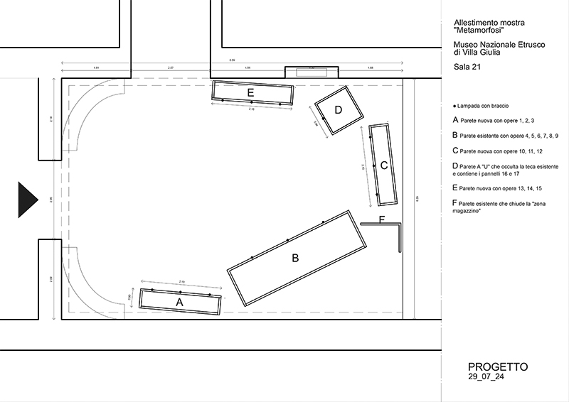
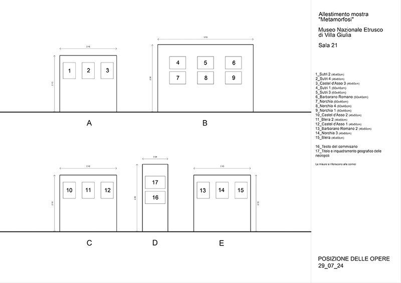
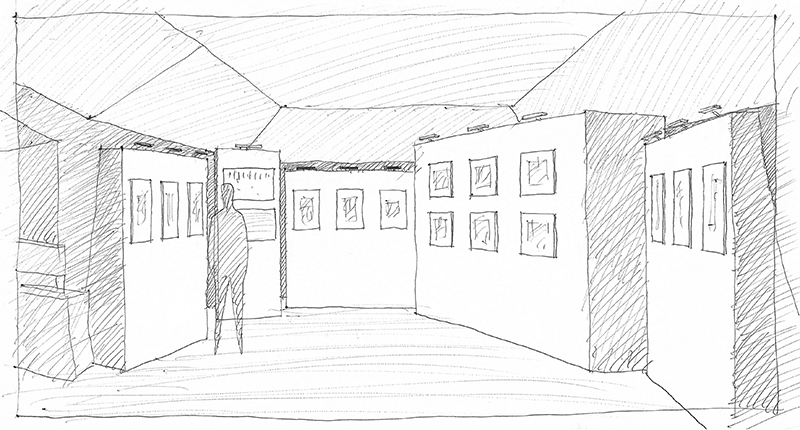
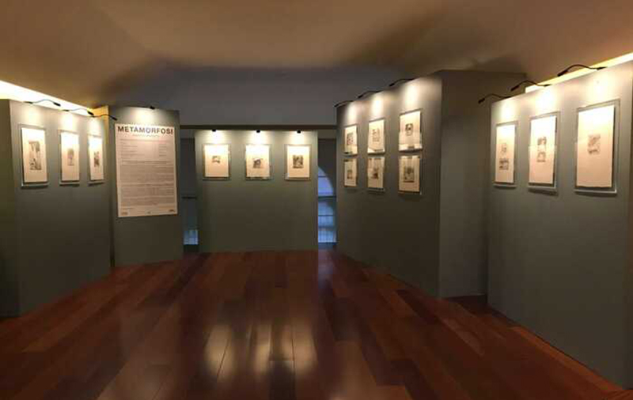

Diseño de la instalación con Michela Mariotti

Comisario: Francesco Moschini

Patrocinado por A.A.M. y Musei Italiani

Dibujos

Planta

Posición de las obras

Croquis de proyecto

Foto del montaje
