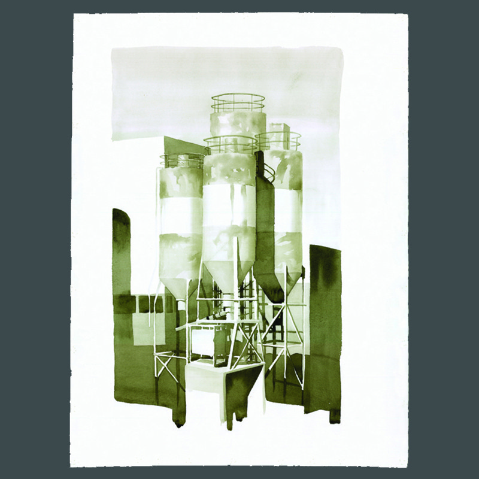
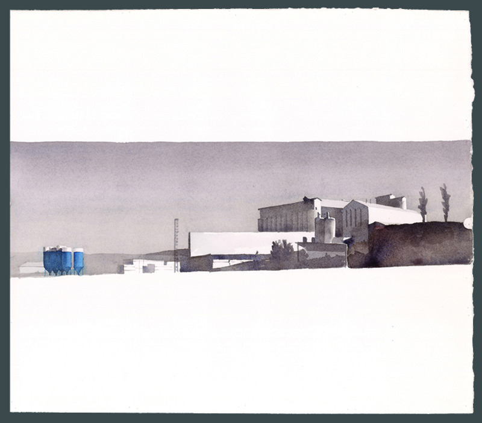
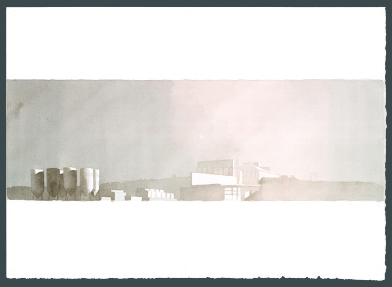
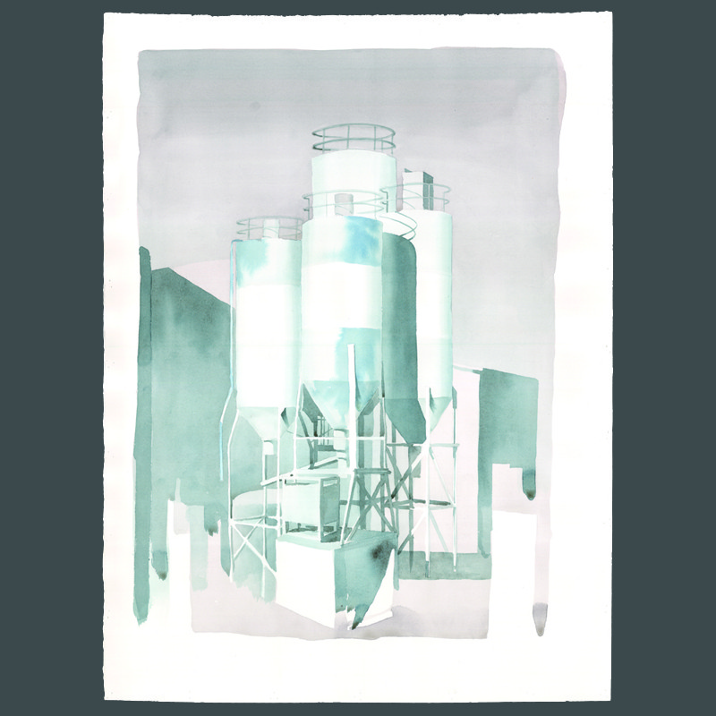
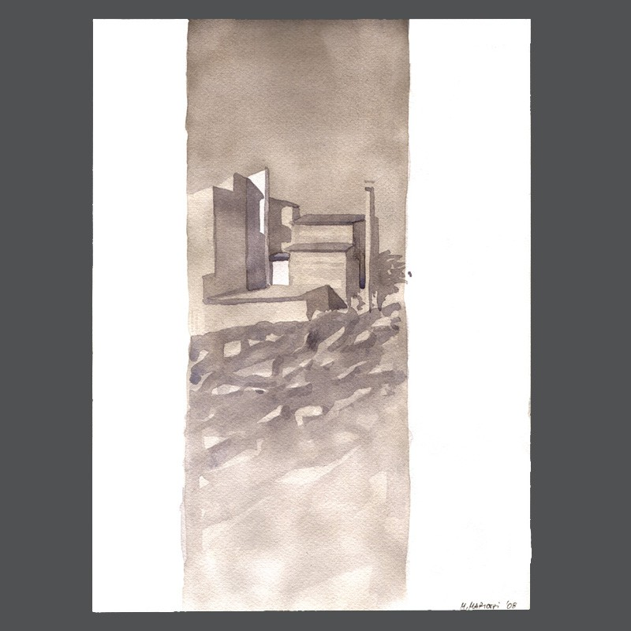
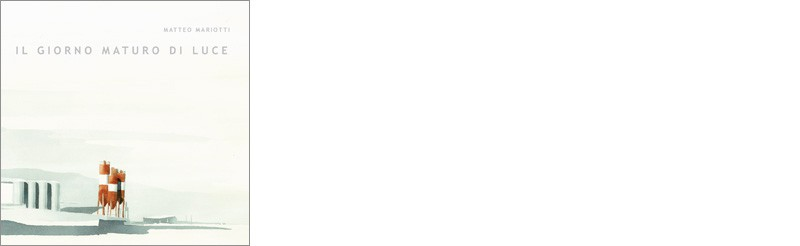

- **Lugar**: Marte Galleria, Roma

*Senza titolo 19,* acuarela, 76 x 57

*Senza titolo 18,* acuarela, 76 x 56

*Senza titolo 25,* acuarela, 57 x 76

*Senza titolo 15,* acuarela, 56 x 77

*Senza titolo 9,* acuarela, 75 x 32

*Senza titolo 10,* acuarela, 47 x 42

*Senza titolo 11,* acuarela, 55 x 40

*Senza titolo 16,* acuarela, 56 x 76

*Senza titolo 3,* acuarela, 72 x 56

*Senza titolo 20,* acuarela, 55 x 76

*Senza titolo 21,* acuarela, 26 x 36

*Senza titolo 17,* acuarela, 56 x 77

*Senza titolo 5,* acuarela, 48 x 35

*Senza titolo 23,* acuarela, 28 x 20

*Senza titolo 22,* acuarela, 21 x 28

Portada del catalogo
