- **Lugar**: galería AOC Flaminia 58, Roma

![]01.jpg)
*Zenitale di frontiera 2,* boligrafo y acrilico sobre papel y madera, 32 x 32 x 3

*Zenitale con preoccupazione,* boligrafo y acrilico sobre papel y madera, 32 x 32 x 3

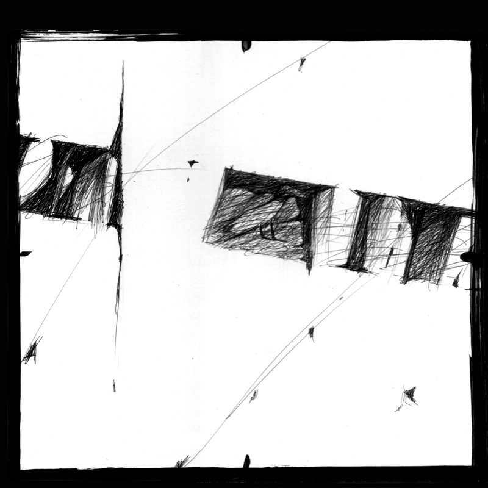
*La scoperta,* boligrafo y acrilico sobre papel y madera, 32 x 32 x 3

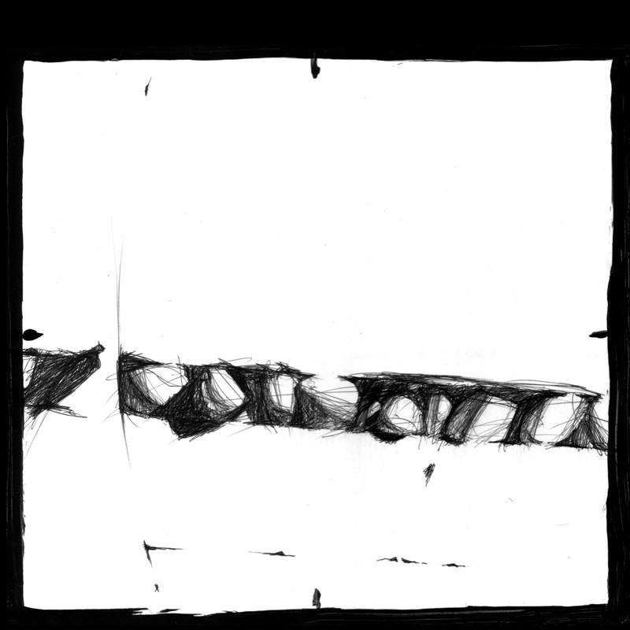
*La scoperta 2,* boligrafo y acrilico sobre papel y madera, 32 x 32 x 3

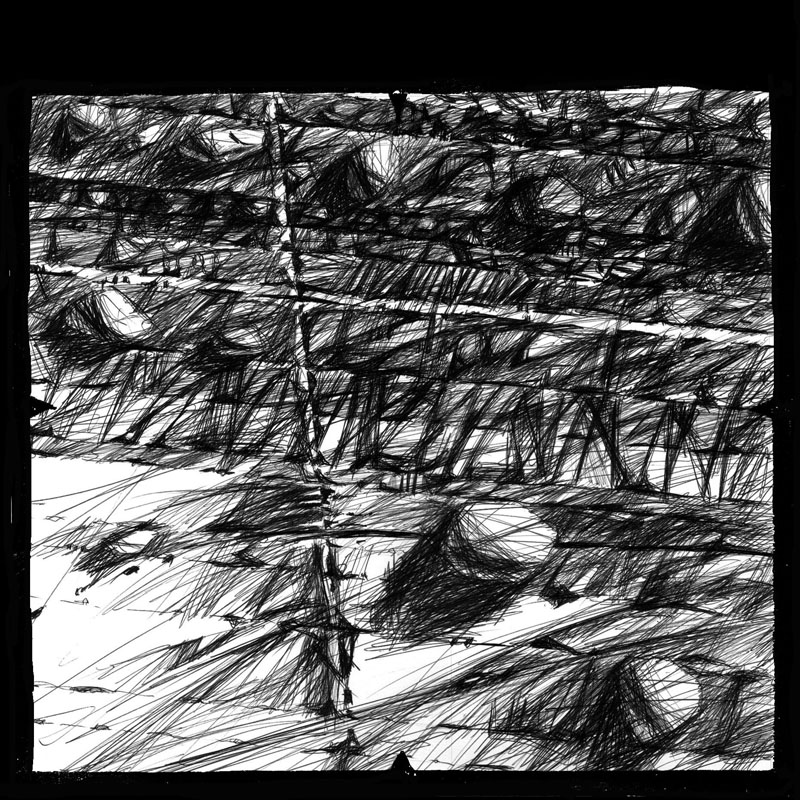
*Zenitale con croce,* boligrafo y acrilico sobre papel y madera, 32 x 32 x 3

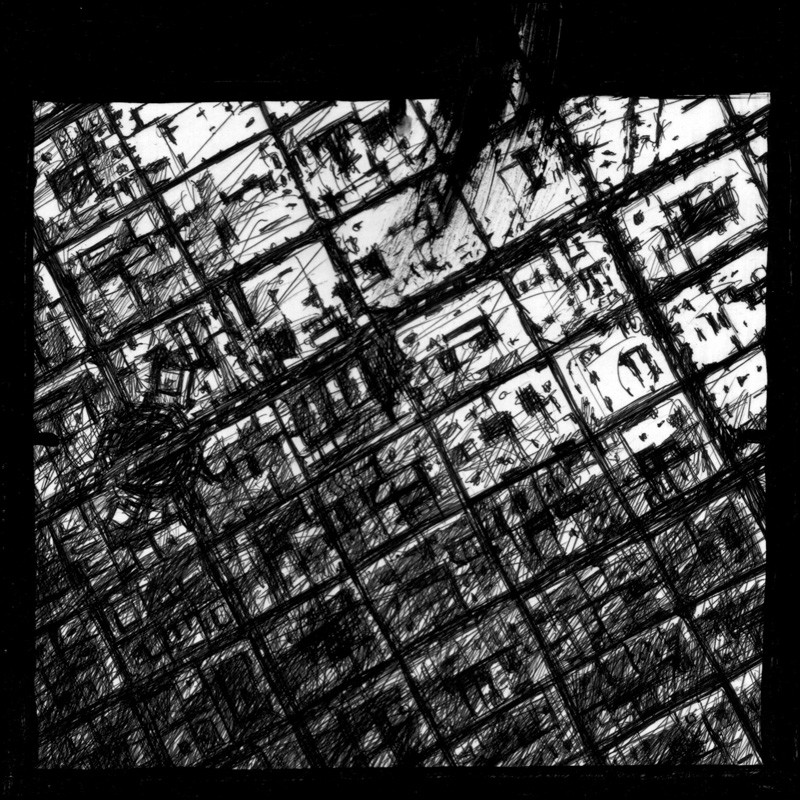
*Zenitale Madrid,* boligrafo y acrilico sobre papel y madera, 24 x 24 x 3

*Zenitale Madrid con pesce,* boligrafo y acrilico sobre papel y madera, 24 x 24 x 3

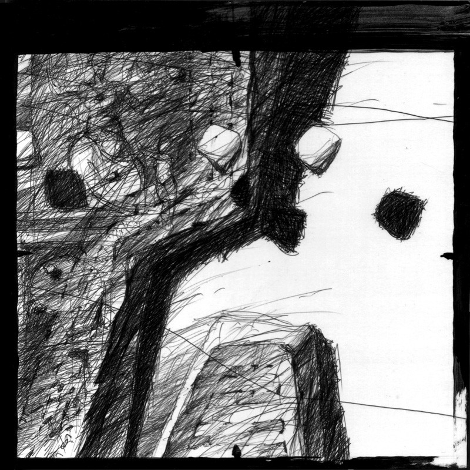
*Zenitale meseta con pietre,* boligrafo y acrilico sobre papel y madera, 24 x 24 x 3

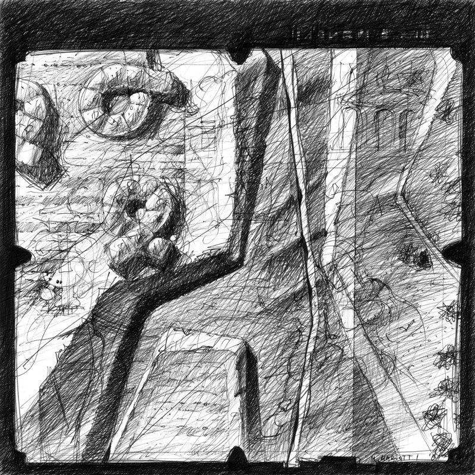
*Zenitale con ciambelle 2,* boligrafo y acrilico sobre papel y madera, 24 x 24 x 3

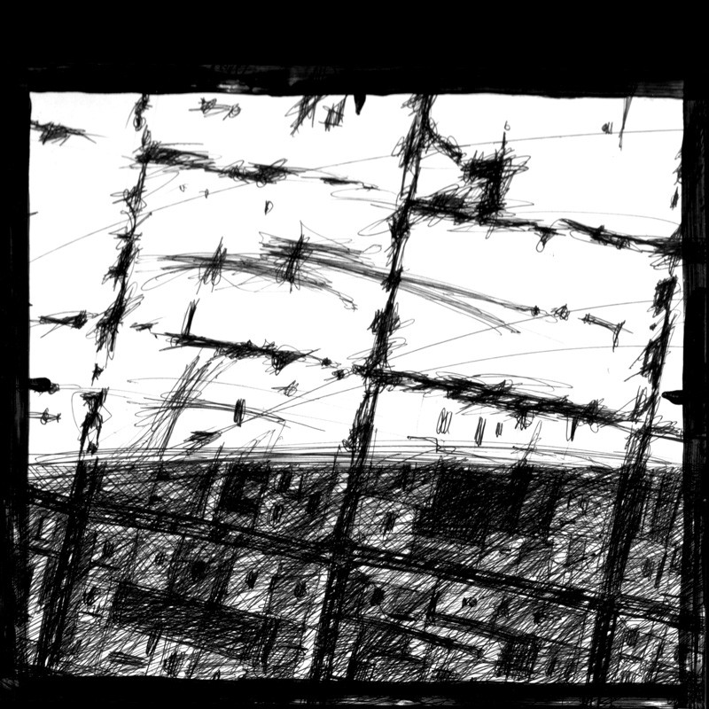
*Zenitale barrio Salamanca,* boligrafo y acrilico sobre papel y madera, 24 x 24 x 3

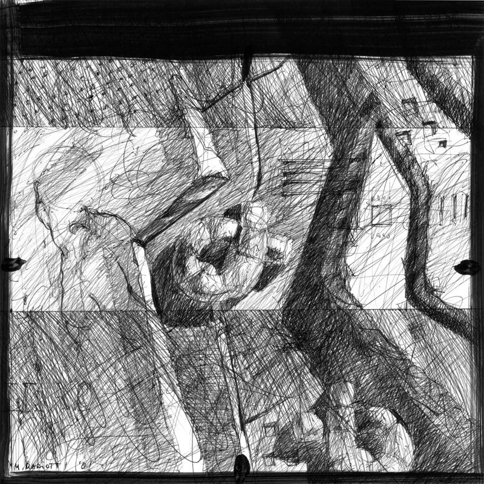
*Zenitale con ciambelle e torso,* boligrafo y acrilico sobre papel y madera, 24 x 24 x 3

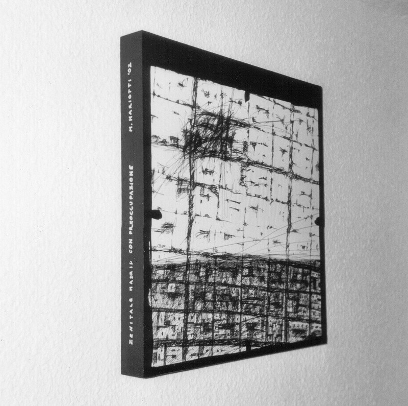
Foto de una tabla

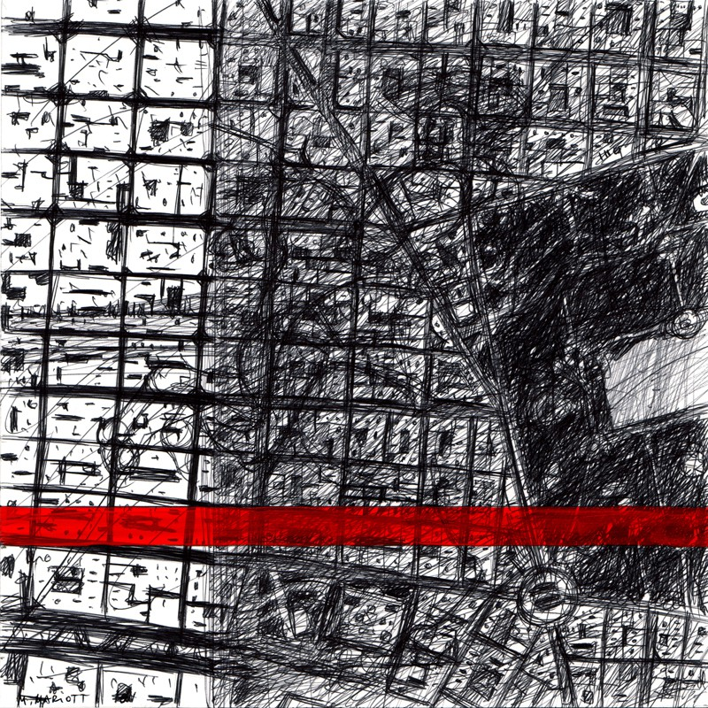
*Alcalá con rosso,* boligrafo y acrilico sobre papel, 45 x 45

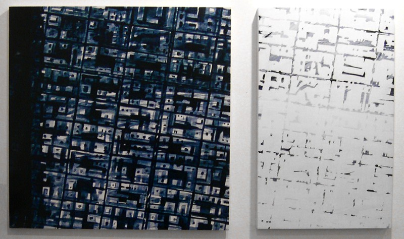
*Doble plano, *diptico,* acrilico sobre madera, 100 x 60

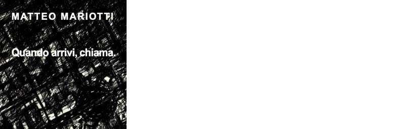
Portada del catalogo
