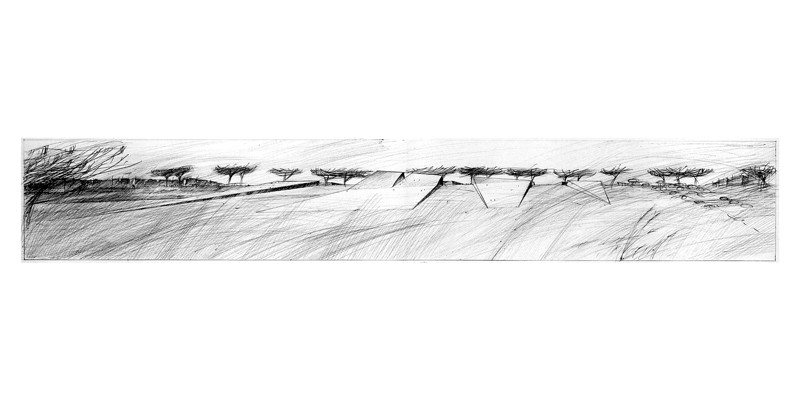
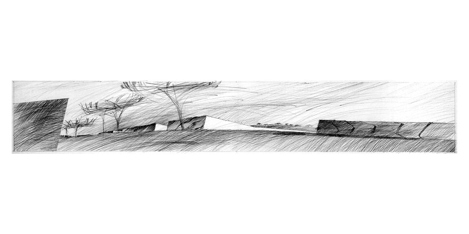
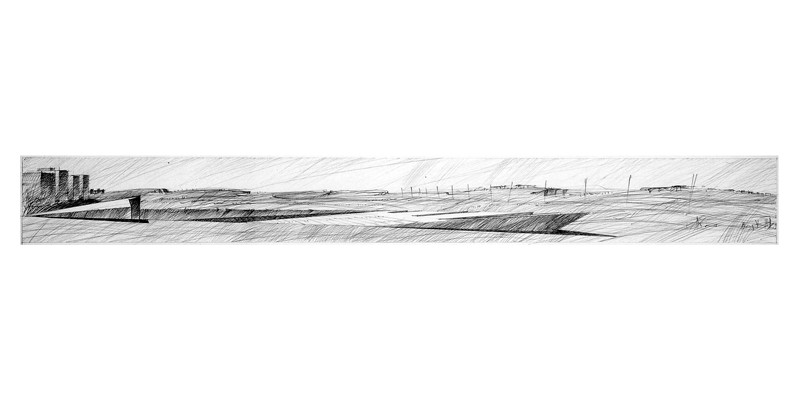
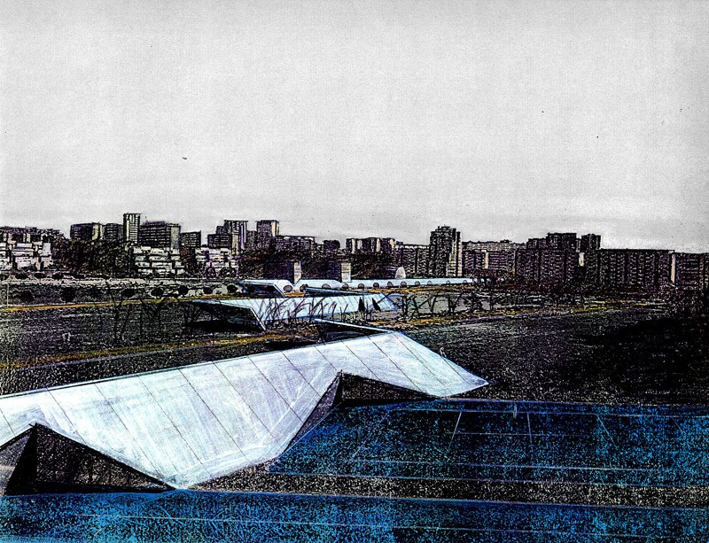
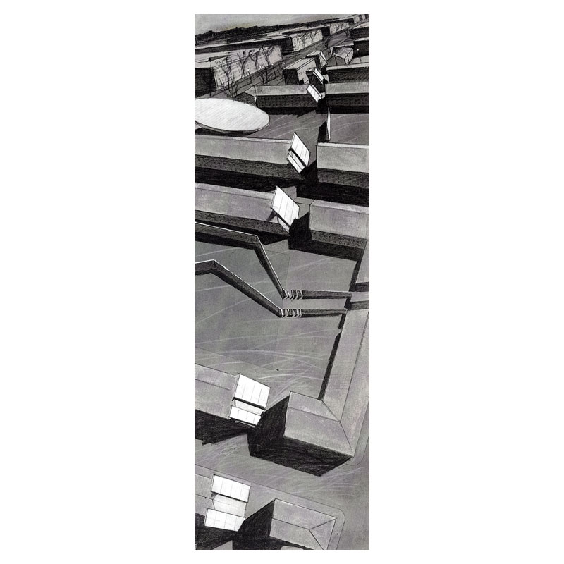

- **Lugar**: Gallery of Penn State University, Roma

La exposición muestra un proyecto (ya presentado en la tesis de fin de carrera) de recuperación de áreas de la periferia y del centro de Roma.

*Intervención en los márgenes de la via Appia*, bolígrafo sobre papel, 100 x 50

*Intervención en los márgenes de la via Appia*, bolígrafo sobre papel, 100 x 50

*Teatro al aire libre en el Parco dell´Appia*, bolígrafo sobre papel, 100 x 50

*Instalaciones deportivas en el Parco dell´Appia,* técnica mixta, 40 x 30

*Intervención en los cuarteles de viale delle Milizie*, tecnica mixta, 14 x 40
