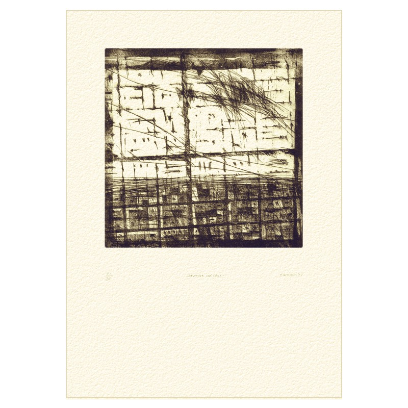
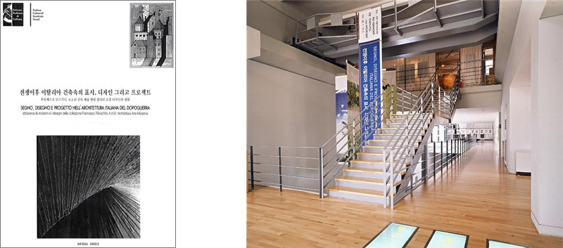

- **Lugar**: Hangang Gallery, Seoul, Corea del sur

**Enlaces relacionados:**

- [Exposición en la web de Galleria A.A.M.](http://www.aamgalleria.it/la-galleria.php?id=584-Extramoenia-Attivita-esterne-della-Galleria-A.A.M.)

*Zenitale con croce*, aguafuerte y aguatinta, mancha 23 x 23 cm

Catalogo y entrada de la exposición
