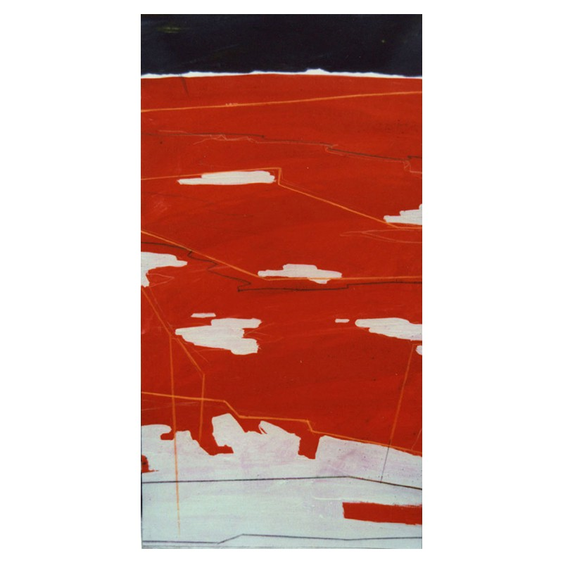
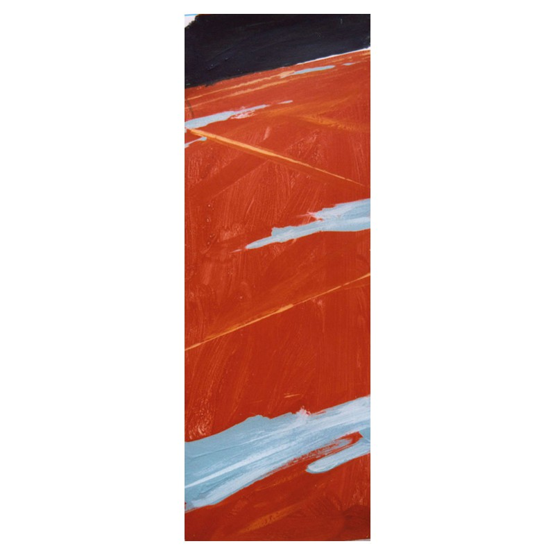
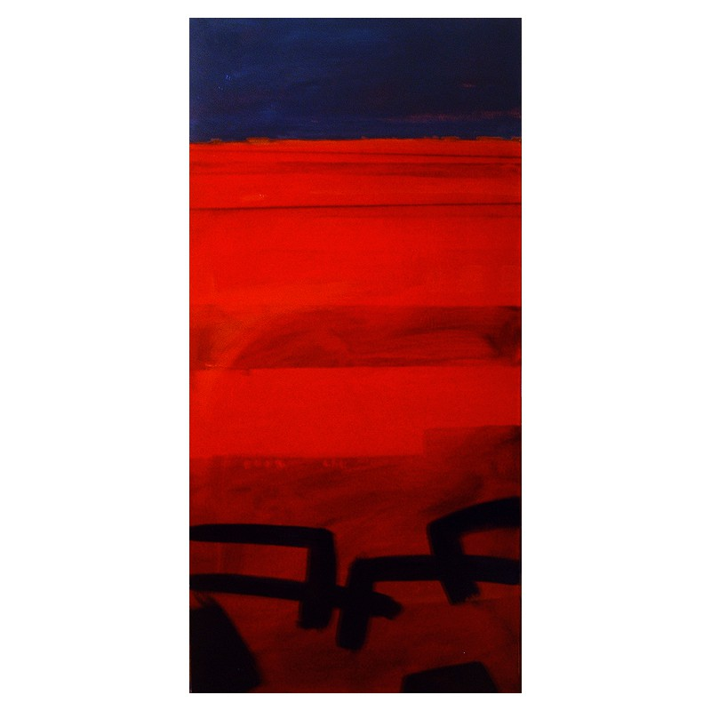
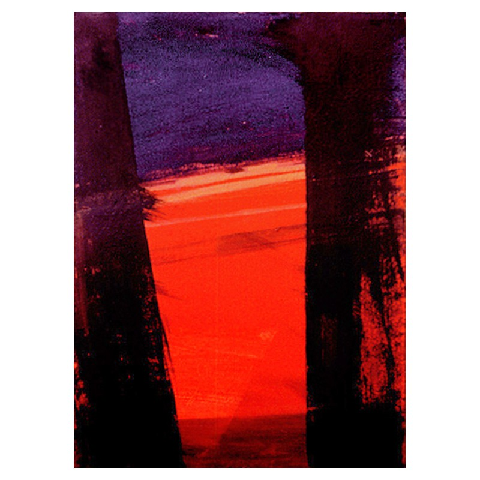
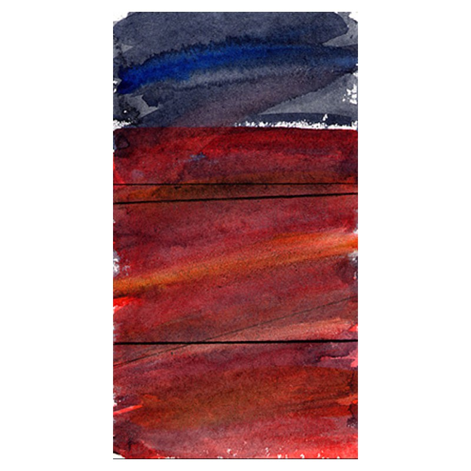

- **Lugar**: Escuela Técnica Superior de Arquitectura de la Universidad Politécnica de Madrid

Beca del Ministero degli Affari Esteri italiano para desarrollar una investigación sobre la representación del espacio urbano

*Sat 1*, acrilico sobre cartulina, 30 x 60

*Sat 2*, acrilico sobre cartulina, 20 x 57

*Sat 7*, acrilico sobre lienzo, 45 x 90

*Sat 8*, acrilico sobre lienzo, 50 x 70

*Sat 6*, acuarela, 15 x 30
