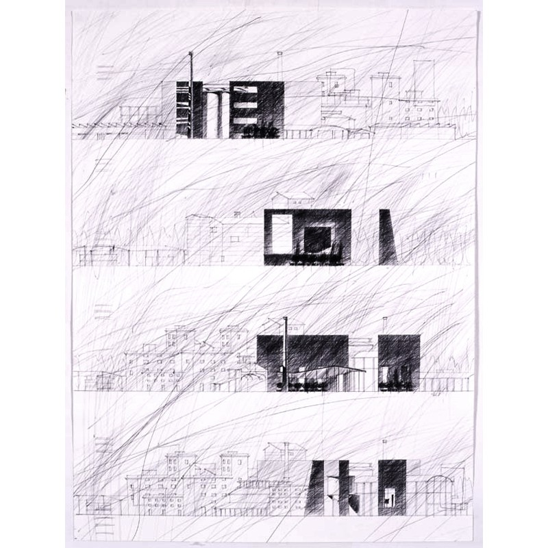
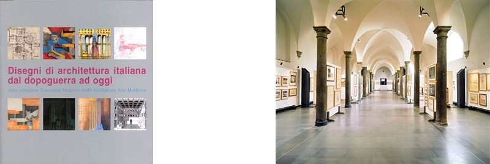

- **Lugar**: Scuderie Medicee, Poggio a Caiano,Firenze

Exposición realizada a partir de la colección privada de Francesco Moschini, A.A.M. Architettura Arte Moderna

### Enlaces relacionados

- [Exposición en la web de Galleria A.A.M.](http://www.aamgalleria.it/la-galleria.php?id=564-Disegni-di-architettura-italiana-dal-dopoguerra-ad)

*Proyecto de remodelación de la Sociedad Gas Rimini*, boligrafo sobre cartulina, 30 x 50

Catálogo y vista de la exposición
