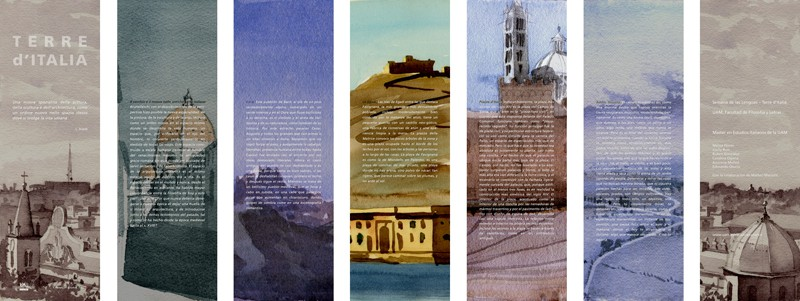
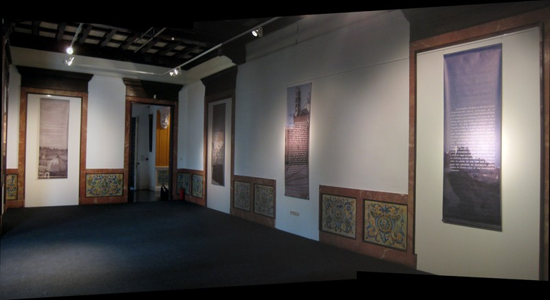
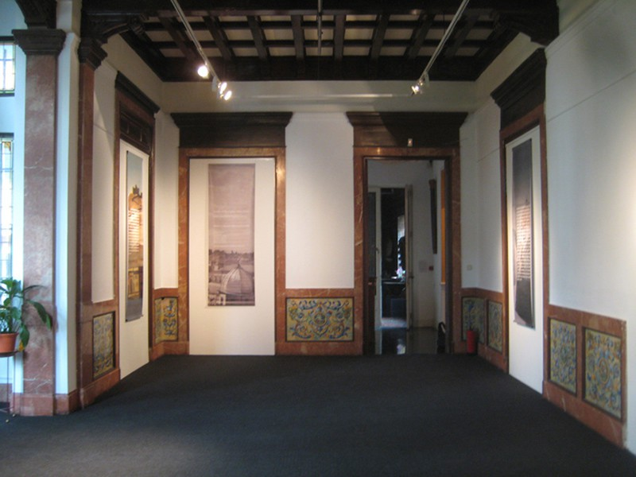
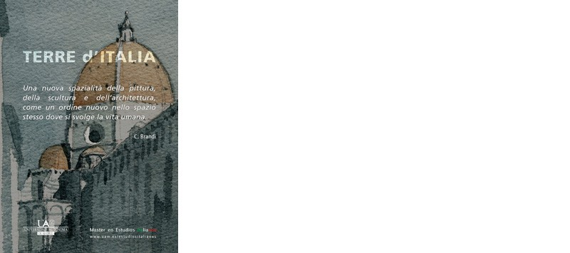

- **Lugar**: Istituto italiano di cultura de Madrid, Facultad de Letras de la Universidad Autónoma de Madrid y Facultad de Letras de la Universidad de Cáceres.

Dentro del Master de Estudios Italianos de la UAM, imparto un seminario sobre el texto *Terre d´Italia* di Cesare Brandi. Los alumnos, bajo la supervisión de Lorenzo Bartoli, director del Master, traducen partes del libro (nunca publicado en España). El trabajo final consiste en siete grandes lonas en las que textos referidos a lugares italianos aparecen superpuestos a otros tantos paisajes.

*Las siete lonas*, acuarela e impresión digital, 80 x 240

Montaje en el Instituto Italiano de Cultura de Madrid

Montaje en el Instituto Italiano de Cultura de Madrid

Cartel de la exposición
