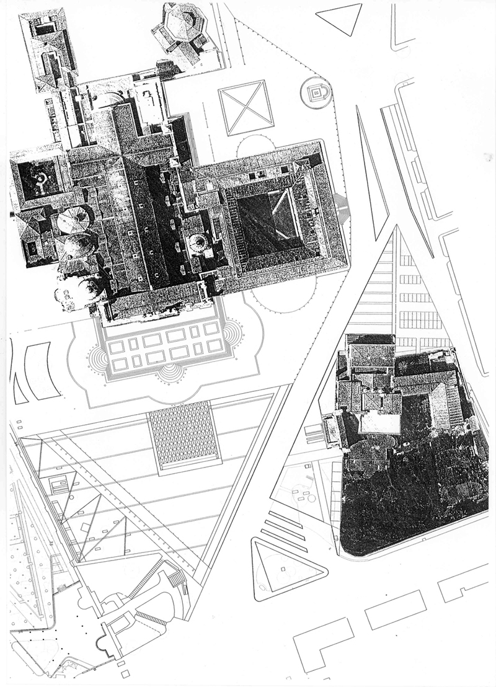
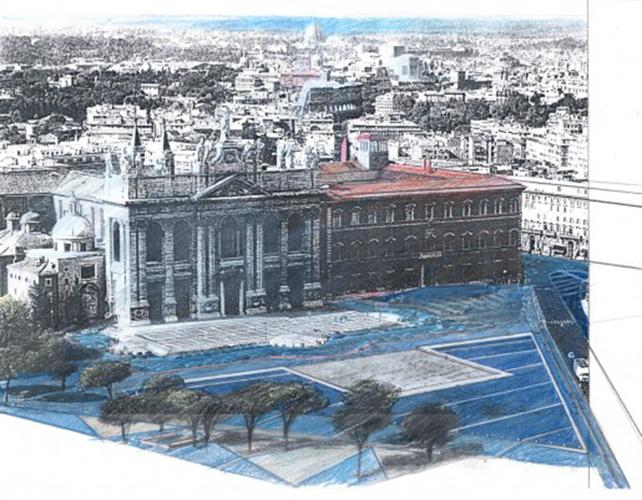
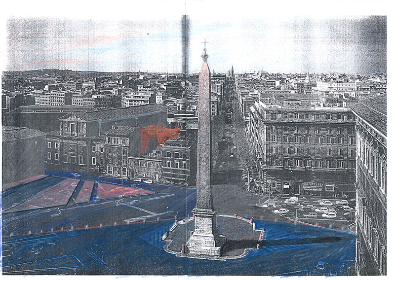
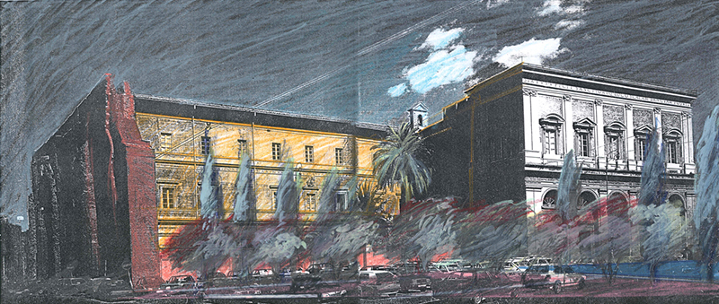
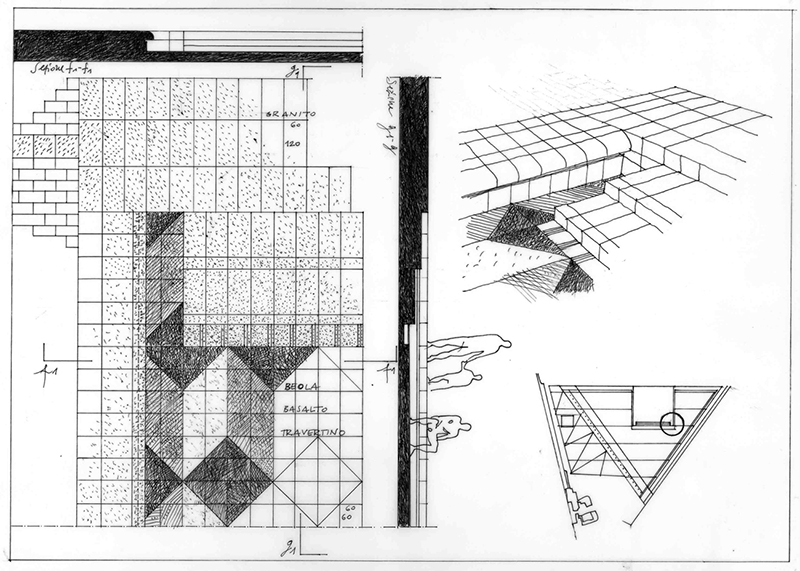
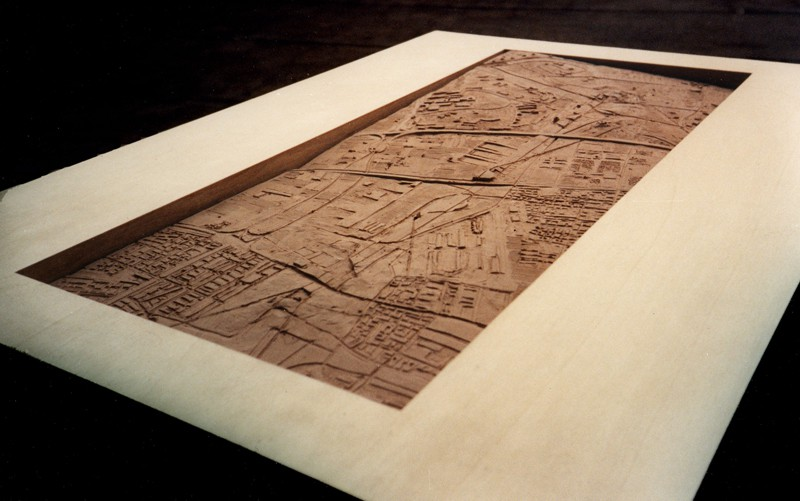
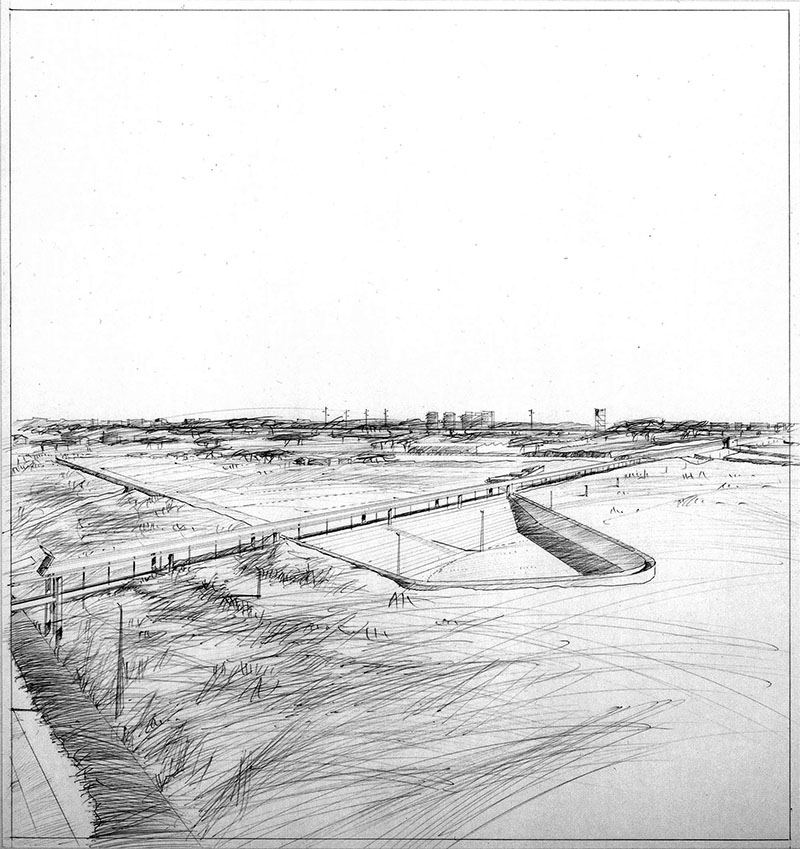
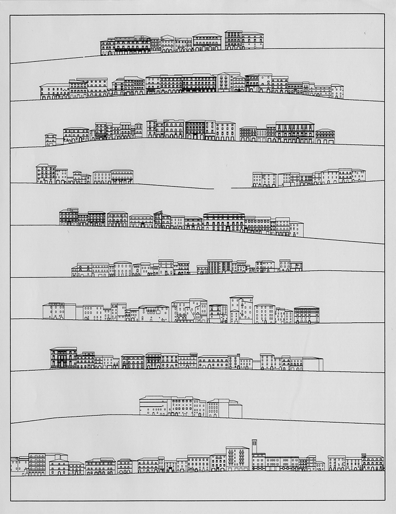
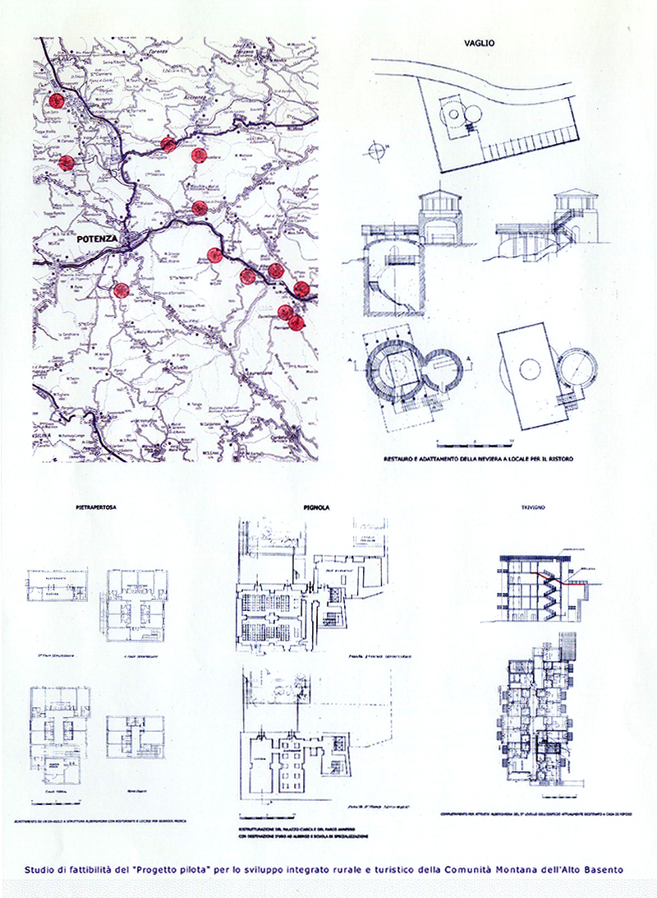

*Plan de intervenciones para el Jubileo 2000. Area de San Giovanni in Laterano,Roma* (1999). Ejecutado.
Con Alessandro Anselmi, Elisabetta Avallone, Gabriele Pierluisi y Fabio Palmia. Planimetría.

*Plan de intervenciones para el Jubileo 2000. Area de San Giovanni in Laterano,Roma* (1999). Ejecutado.
Con Alessandro Anselmi, Elisabetta Avallone, Gabriele Pierluisi y Fabio Palmia. Vista plaza.

*Plan de intervenciones para el Jubileo 2000. Area de San Giovanni in Laterano,Roma* (1999). Ejecutado.
Con Alessandro Anselmi, Elisabetta Avallone, Gabriele Pierluisi y Fabio Palmia. Vista zona obelisco.

*Plan de intervenciones para el Jubileo 2000. Area de San Giovanni in Laterano, Roma* (1999). Ejecutado.
Con Alessandro Anselmi, Elisabetta Avallone, Gabriele Pierluisi y Fabio Palmia. Vista zona Escalera Santa.

*Plan de intervenciones para el Jubileo 2000. Area de Santa Croce in Gerusalemme, Roma* (1999). Ejecutado.
Con Alessandro Anselmi, Elisabetta Avallone, Gabriele Pierluisi y Fabio Palmia. Planimetría.

*Plan de intervenciones para el Jubileo 2000. Area de Santa Croce in Gerusalemme, Roma* (1999). Ejecutado.
Con Alessandro Anselmi, Elisabetta Avallone, Gabriele Pierluisi y Fabio Palmia. Detalle plaza.

*Proyecto de infraestructuras para el area de Tor Cervara, Roma* (1997). PFC. Maqueta en barro.

*Proyecto de infraestructuras para el area de Tor Cervara, Roma* (1997). PFC. Vista de un centro polideportivo y ferrocarril.

*Proyecto de infraestructuras para el area de Tor Cervara, Roma* (1997). PFC. Vista general.

*Proyecto de rehabilitación urbanistica y edilicia del “Borgo Serrone”. Sant'Arsenio, Salerno, Italia* (1998). Con Roberto Mariotti (GRAU) , STEC y Danilo Novelli. Planimetría.

*Proyecto de rehabilitación urbanistica y edilicia del “Borgo Serrone”. Sant'Arsenio, Salerno, Italia* (1998). Con Roberto Mariotti (GRAU) , STEC y Danilo Novelli. Planimetría y secciones de las calles.

*Programa de rehabilitación urbanística del Casco Antiguo de Camerino, Macerata, Italia* (1998). Con Roberto Mariotti (GRAU), Francesco Montuori (GRAU) y STEC. Secciones de las calles.

*Proyecto piloto por el desarrollo rural y turístico de la Comunitá Montana dell'Alto Basento, Potenza, Italia* (1998). Con Roberto Mariotti (GRAU) y STEC.
